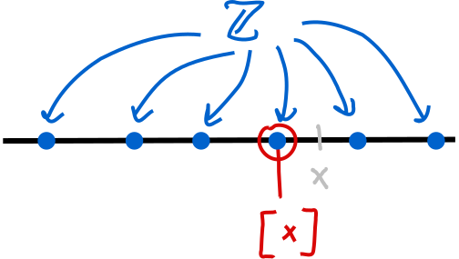
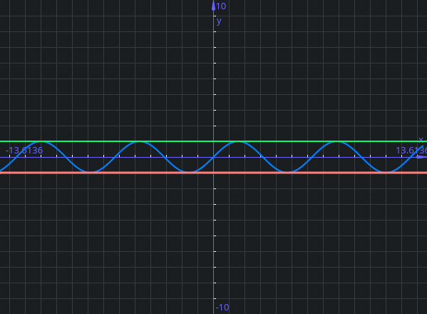
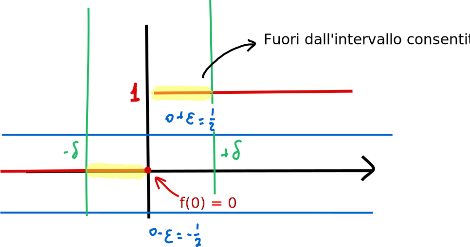
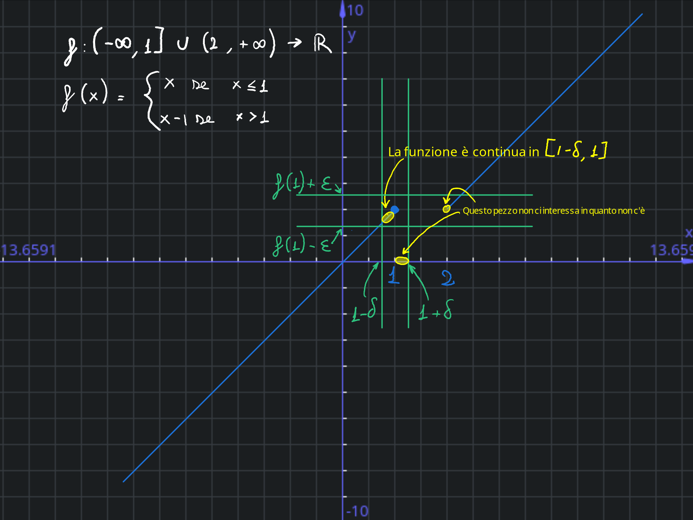
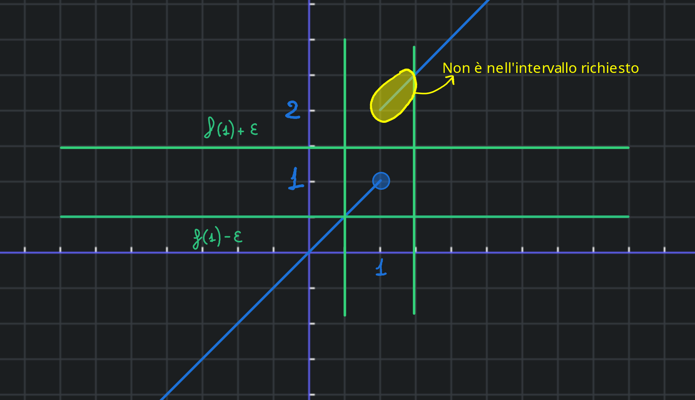
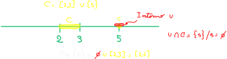
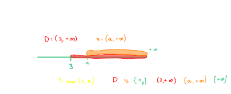
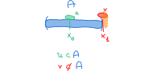
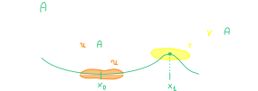

## Massimo, maggiorante ed insieme limitato
### Massimo di un insieme

!!! definition "Massimo dell'insieme"
    $A \in \mathbb R, A \ne 0, m \in \mathbb R \text{ si dice massimo di A se } m \ge a \quad \forall a \in A \text{ e } m \in A$  
    Dato un subset A di R non vuoto, un numero m reale si dice massimo dell'insieme A se m >= di a e m è in A

Quindi ad esempio se A è l'intervallo $A = [0,1] \Rightarrow max(A) =1$  
Tuttavia non tutti gli insiemi hanno un massimo: 
$B = [0,1)$ allora B non ha massimo  
La dimostrazione è abbastanza semplice quando fatta per assurdo:

??? abstract "Dimostrazione"
    Preso come esempio l'intervallo B appena citato, possiamo prendere un numero nell'insieme B e chiamarlo m (ad esempio 0.9). Troviamo quindi un $\epsilon=1-m > 0$ (in questo caso $\epsilon = 0.1$)  
    A questo punto possiamo definire $m_1 = m + \frac \epsilon 2$.  
    Avremo quindi che $m < m_1$, con $m_1 \in B$ e quindi $m_1$ dovrebbe essere il massimo.  
    Quindi B non ha massimo.

### Maggiorante

!!! definition "Maggiorante"
    Dato $A \subset \mathbb R, A \ne \varnothing$ un numero $k \in \mathbb R$ si dice maggiorante di A se $k \ge a \forall a \in A$.  
    L'insieme di tutti i maggioranti si indica con $\mathcal M_A$

Un maggiorante deve essere quindi più grande di tutti gli elementi di A e non è detto che appartenga ad A.  
Quindi, riprendendo l'esempio precedente $A=[0,1]$, $3 \in \mathcal M_A$, mentre $\frac 1 4$ non è un maggiorante  
Possiamo quindi fare un paio di osservazioni:

- Se esiste un maggiorante di A allora ne esistono infiniti: se k è un maggiorante di A allora m è un maggiorante di A $\forall m \ge k$
- Alcuni insiemi non hanno maggioranti: $A = \mathbb R$ non ha maggioranti, così come la semiretta $[4, +\infty)$

### Insieme superiormente limitato

!!! definition "Insieme limitato superiormente"
    Se l'insieme dei maggioranti è non vuoto $\mathcal M_A \ne \varnothing$, l'insieme A si dice limitato superiormente

### Minimo, minorante ed insieme limitato inferiormente

!!! attention "Minimo, minorante ed insieme inferiormente limitato"
    **Le stesse definizioni ma opposte si applicano per minimo, minorante e insieme inferiormente limitato**

??? definition "Minimo dell'insieme"
    $A \in \mathbb R, A \ne 0, m \in \mathbb R \text{ si dice minimo di A se } m \le a \quad \forall a \in A \text{ e } m \in A$  

??? definition "Minorante"
    Dato $A \subset \mathbb R, A \ne \varnothing$ un numero $k \in \mathbb R$ si dice minorante di A se $k \le a \forall a \in A$.  

??? definition "Insieme limitato inferiormente"
    Se l'insieme dei minoranti è non vuoto $m_A \ne \varnothing$, l'insieme A si dice limitato inferiormente

### Insieme limitato

!!! definition "Insieme limitato"
    Dato un insieme $A \subset \mathbb R, a \ne \varnothing$ se A è sia superiormente che inferiormente limitato, allora A si dice limitato

Un insieme A è quindi limitato se e solo se $\exists h,k \in \mathbb R$ tale che $k \le a \le h \quad \forall a \in A$  
Quindi i due valori sono estermi all'insieme, limitandolo.  

## L'estremo di una funzione

!!! definition "Teorema dell'estremo superiore"
    Dato un sotto insieme di R $A \subset \mathbb R, A \ne \varnothing$, superiormente limitato, allora esiste il minimo dell'insieme dei maggioranti. Tale minimo si dice estremo superiore di A e si indica con $sup(A)$

L'estremo superiore è quindi il minimo dei maggioranti, ed ogni insieme limitato superioremente ha un estremo superiroe.  
Possiamo quindi vedere che l'insieme dei maggioranti ha sempre minimo  

Quindi, ad esempio:  

- $A = [0,1) \Rightarrow \mathcal M_A = [1,+\infty)$. Il minimo dell'insieme dei maggioranti è 1, quindi l'estremo superiore di A è 1.  
- $B = [0,1] \Rightarrow \mathcal M_B = [1,+\infty)$. Il minimo dell'insieme dei maggioranti è 1, quindi l'estremo superiore di B è 1.  

!!! observation "Il massimo di un insieme è il suo limite superiore"
    Se esiste il massimo di un insime A, allora il massimo di A coincide con l'estremo superiore.  
    un insieme limitato superiormente ha sempre un estremo superiore. Se questo elemento appartiene anche all'insieme è anche un massimo:  
    $\exists \; max(A) \rightarrow max(A) = sup(A)$ (Se esiste $max(A)$ allora $max(A)=sup(A)$)

!!! notation "Insieme non limitato superiormente"
    Se l'insieme A non è superiormente limitato, scriviamo $sup(A) = + \infty$

!!! observation "Verificare che un oggetto è un estremo superiore"
    $A \ne \varnothing$ superioremente limitato.  
    Allora $m = sup(A)$ se e solo se valgono:

    - $a \le m \; \forall a \in A$ (che significa che m è un maggiorante)
    - $\forall \epsilon > 0 \;  \exists \; \bar a \in A$ tale che $\bar a > m - \epsilon$ (spostarsi a sinistra di m c'è un elemento a destra di m  \epsilon, non ci sono maggioranti più piccoli di m; m è il più piccolo dei maggioranti)

    

!!! observation "Un insieme superiormente limitato è minore di infinito"
    La scrittura $sup(A) < + \infty$ singifica che l'estremo superore di A è un numero reale, quindi A è superiormente limitato.  

### La retta reale estesa

!!! definition "Retta reale estesa"
    $\bar{ \; \mathbb{R} \; } = \mathbb{R} \cup \{-\infty\} \cup \{+\infty\}$  
    in modo che valga $-\infty \le m \le + \infty \quad \forall x \in \bar{\;\mathbb R\;}$
    Ergo, se $x \in \mathbb R$ (quindi $x \ne +\infty, x \ne -\infty$), allora $-\infty < x < + \infty$

#### Operazionu sulla retta reale estesa

Operazioni in $\bar {\mathbb R}$  

- Se $x \ne +\infty$, allora $x + (- \infty) = - \infty$
- Se $x \ne -\infty$, allora $x + (+ \infty) = + \infty$
- Se $x \gt 0$ allora $x \cdot (+ \infty) = + \infty$ e $x \cdot (- \infty) = - \infty$
- Se $x \lt 0$ allora $x \cdot (+ \infty) = - \infty$ e $x \cdot (- \infty) = + \infty$

Operazioni vietate (forme indeterminate)  

- $(+ \infty) + (- \infty)$
- $0 \cdot (+ \infty)$
- $0 \cdot (- \infty)$

Operazioni valide  

- $+ \infty \cdot + \infty = + \infty$
- $+ \infty \cdot - \infty = - \infty$
- $- \infty \cdot - \infty = + \infty$

### Minimi e massimi di insiemi limitati

!!! observation "Insiemi limitati hanno minimi o massimi"
    Dato $A \subset \mathbb Z$ (interi) se A è superiormente limitato, A ha massimo.  
    Se A è inferiormente limitato, allora A ha minimo  

!!! definition "Parte intera"
    Dato $x \in \mathbb R$ si dice parte intera di x e si indica con $[x]$ il numero $[x] = max \{ m \in \mathbb Z : m \le x \}$.  
    { loading=lazy, width=200 }

Ovvero: se abbiamo x (reale) tra due interi, la parte intera di x è il primo intero che si ottiene spostandosi a sinistra. Ad esempio:  

- $[\frac {25}{10}] = 2$
- $[-\frac {25}{10}] = -3$

## Funzioni limitate

!!! definition "Funzione limitata"
    f si dice limitata:  
    
    - **superiormente** se f(a) (la sua immagine) è limitato superiormente
    - **inferiormente** se f(a) (la sua immagine) è limitato inferiormente
    - se $f(a)$ (la sua immagine) è limitato

### Massimo e minimo di una funzione

!!! definition "Funzione con massimo"
    $f$ ha massimo se $f(A)$ (la sua immagine) ha massimo.  
    Si dice che $M$ è il massimo di $f$ e si scrive  
    $M = max(f)$ se $M = max(A)$

??? definition "Funzione con minimo"
    $f$ ha minimo se $f(A)$ (la sua immagine) ha minimo.  
    Si dice che m è il minimo di $f$ e si scrive  
    $m = min(f)$ se $m = min(A)$

### Limiti di una funzione

!!! definition "Limiti di una funzione"
    $sup(f) = sup(f(A))$  
    Se $f$ non è limitata superiormente si scrive $sup(f) = + \infty$.  
    Lo stesso vale per inf (limite inferiore).  

### Punti di massimo di una funzione

!!! definition "Punti di massimo"
    Se $f$ ha massimo allora i punti $\forall x_0 \in A | f(x_0) = max(f)$ si dicono punti di massimo.  
    Se $f$ ha minimo allora i punti $\forall x_0 \in A | f(x_0) = min(f)$ si dicono punti di minimo.  

!!! observation "Massimo e punti di massimo"
    Il massimo di $f$ è unico; i punti di massimo potrebbero essere molti.  
    Lo stesso vale per il minimo.  
    { loading=lazy }  
    Nella funzione seno, il massimo è $max(f) = 1$ e 0 i punti di massimo sono $x_0 = \frac \pi 2 + k\cdot 2 \pi, k \in \mathbb Z$

Una funzione come $f:(0, +\infty) \rightarrow \mathbb R \quad f(x) = \frac 1 x$ non ha né massimo né minimo. La funzione ad infinito tende a 0:  
Se avesse massimo $\Rightarrow \exists M$ tale che $f(x) \le M \forall x \in (0, + \infty)$:  
$f(x) > 0 \forall x \Rightarrow 0$ è un minorante $0=inf(f)$ (inf = estremo inferiore)  
0 è quindi l'estremo inferiore di f, ma 0 **NON** è un minimo.  
Se la funzione avesse minimo, allora dovrebbe essere $min(f)=inf(f)=0$, quindi dovrebbe esistere un $x_0$ tale che $f(x_0)=0$ cioè $\frac 1 {x_0}$, che è impossibile.  

!!! observation ""
    $f: A \rightarrow \mathbb R$ allora $m = sup(f)$ se e solo se:  
    
    1. $f(x) \le m \forall x \in A$
    2. $\forall \epsilon > 0 \exists \bar x \in S$ tale che $f(\bar x) > m - \epsilon$  
        Se si abbassa la quota di m si "taglia" la funzione

## Valore assoluto

!!! definition "Valore assoluto"
    Dato $x \in \mathbb R$ si dice valore assoluto di x e si indica con |x| il numero $|x| = max(x,-x)$

Quindi:  

1. $x \le |x|$
2. $|x| = x$ se $x \ge 0$, $|x| = -x$ se $x \le 0$
3. $|x| \ge 0 \forall x \in \mathbb R$
4. $|x| = 0 \Leftrightarrow x = 0$
5. $|x| = |-x|$
6. $-|x| \le x \le |x|$
7. $|x| \le M \Leftrightarrow -M \le x \le M$ ($M \gt 0$)
8. $|x| \gt M \Leftrightarrow x \gt M$ oppure $x \lt -M$

Come altre proprietà possiamo poi aggiungere:  

- $|x| \le x_0 \Leftrightarrow -x_0 \le m \le x_0$
- $|x| \ge x_0 \Leftrightarrow x \le -x_0$ oppure $x \ge x_0$

### Disuguaglianza triangolare  
!!! definition "Disuguaglianza triangolare"
    Dati $a, b \in \mathbb R$ , risulta che:  

    1. $|a + b| \le |a| + |b|$
    2. $||a| - |b| | \le |a-b|$

    Questo discorso vale anche per più valori:  

    $|a + b + c| \le |a + b + c|$  
    $|a + b + c| = |(a + b) + c| \le |a + b| + |c| \le |a| + |b| + |c|$

## La continuità
!!! definition "Funzione continua in un punto"
    $A \subset \mathbb R, f: A \rightarrow \mathbb R, x_0 \in A$.  
    La funzione si dice continua in x_0 se $\forall \epsilon > 0 \; \exists \; \delta > 0$ 
    tale che
     $x \in A, |x - x_0| < \delta \Rightarrow |f(x) - f(x_0)| < \epsilon$  

    Spiegandola un po':  

    - $|x - x_0| < \delta \Leftrightarrow x_0 - \delta < x < x_0 + \delta$ ($x$ è compreso tra $x_0 \pm \delta$ )
    - $|f(x) - f(x_0)| < \epsilon \Leftrightarrow f(x_0) - \epsilon < f(x) < f(x_0) + \epsilon$ (la funzione oscilla intorno ad $f(x_0)$ ad un ampiezza massima di $\epsilon$)
    - Se esiste un $\delta$ nell'$epsilon$ dato, la funzione è continua

!!! observation "Una funzione è sempre continua nei punti isolati"
    La continuità include un concetto di prossimità del punto (al punto dove si considera la continuità): se il punto è isolato non è possibile avvicinarsi al punto, ci si può solo "trovare" nel punto.  

??? example "Esempio di funzione non continua in un punto"
	Data la funzione  
	  
	$f(x) = 
	\begin{cases}
		0 \text{ se } x \le 0 \\
		1 \text{ se } x > =0
	\end{cases}$

	Questa funzione non è continua nel punto $x_0 = 0$ (in cui scegliamo $\epsilon = \frac 1 2$):  
	{ loading=lazy }
	In questa funzione, $\forall \delta > 0, x \in (0, \delta) \rightarrow f(x) =1$  
	La disuguaglianza $f(x) < f(0)+\epsilon$ è falsa:  
	$0-\frac 1 2 < f(x)  < 0 + \frac 1 2$:  
	$1 < \frac 1 2 \Rightarrow f$ non è continua in $x_0 = 0$

!!! definition "Funzione continua in un insieme"
	Dati $A \in \mathbb R, f: A \rightarrow \mathbb R, B \subset A$,  
	Si dice che la funzione $f$ è continua in B se è continua in ogni punto $x_0 \in B$.  
	Se si dice che f è continua (senza specificare il sottoinsieme B), significa che f è continua in tutti i punti del suo dominio A.  

??? example "Esempio di funzione non continua in un insieme"
	Riprendendo la funzione di prima  
	
	$f(x) = 
	\begin{cases}
		0 \text{ se } x \le 0 \\
		1 \text{ se } x > =0
	\end{cases}$

	Questa funzione è continua in $(-\infty, 0) \cup (0, + \infty)$

### Teoremi sulla continuità
!!! theorem "Teorema sulla permanenza del segno"
	$A \subset \mathbb R, f:A \rightarrow \mathbb R, x_0 \in A$  
	Se f è continua in $x_0$ e $f(x_0) > 0$ allora $\exists \delta > 0$ tale che se $x \in A$ e $|x -x_0| < \delta Rightarrow f(x) > 0$.  
	Stesso risultato se $f(x) < 0$

Quindi, se una funzione continua assume valore di segno positivo in un punto, allora mantiene lo stesso segno nei punti molto vicini al punto.  

??? abstract "Dimostrazione"
    Sappiamo che $f(x_0) > 0$.  
	Scelgo $\epsilon = \frac {f(x_0)} 2$ e lo uso nella definizione di continuità.  
	Esiste quindi un $\delta >0$ tale che $x \in A, |x - x_0| < \delta \Rightarrow |f(x) - f(x_0)|< \epsilon$  
	  
	Ovvero: $f(x_0) - \epsilon < f(x) < f(x_0) + \epsilon$  
	Prendendo la prima parte della disuguaglianza, si ottiene che $f(x) > f(x_0) - \epsilon = f(x_0) - \frac {f(x_0)} 2 \Rightarrow \frac {f(x_0)} 2 > 0$  
    Essendo il valore lontano da zero, se ci si sposta un po' vicino al punto; Il valore della fuzonone si sposta poco e quindi il segno rimane concorde.  

    ---

    Questo discorso vale anche per un valore $m \in \mathbb R$ tale che $f(x_0) > m$  
    In tal caso $\exists \delta > 0$ t.c. $x \in A, |x - x_0| < \delta \Rightarrow f(x) > m$  
    (Questo discorso vale anche con $f(x) < m \Rightarrow f(x) < m$)  

---

!!! theorem "Teorema sulla combinazione di funzioni continue (somma e prodotto)"
	Se $f$ e $g$ sono continue in $x_0$ allora lo sono anche le funzioni $f+g$, $f \cdot g$ e $|f|$.  
	Se inoltre $f(x_0) \neq 0$, allora anche $\frac 1 f$ è continua.  
	$\frac f g$ è continua (se $g(x_0) \ne 0$ ).  
	$\frac f g = f \cdot \frac 1 g$

---

$I \subset \mathbb R$ intervallo, $f: I \rightarrow B \subset \mathbb R$.  
Se $f$ è continua in $I$ ed è invertibile, allora $f^{-1}$ è continua.  
L'ipotesi che il dominios sia un'intervallo non può essere omessa.  

??? example "Esempio"	
	$f:(-\infty, 1] \cup (2, +\infty) \rightarrow \mathbb R$  
	$f(x)=
	\begin{cases}
		x \quad \;\;\; \text{ se } x \le 1 \\
		x-1 \text{ se } x > 1
	\end{cases}$  
	Alla domanda se la funzione è continua, la risposta è sì.  
	{ loading=lazy }  
	  
	Tuttavia la sua inversa $f^{-1}: \mathbb R \rightarrow (-\infty, 1] \cup (2, + \infty)$ non è continua in $x_0$.  
	Non è continua perché c'è una specie di salto in $x=1$:  
	{ loading=lazy }  

Se f non è definita su un intervallo, potrebbe accadere che la sua funzione inversa non sia continua, anche se la funzione è continua.  

### Continuità delle funzioni elementari

- Le funzioni costanti sono continue  
- $f(x) = x$ è continua. Da ciò segue che tutti i polinomi sono continui:  
	
	Un polinomio ( $p(x) = a_n \cdot x^n + a_{n-1} \cdot x^{n-1} + ... + a_1 \cdot x + a_0$ ) ha i coefficienti come numeri reali ($a_0, a_1, ..., a_n \in \mathbb R$). Quindi dal [teorema su somma e del prodotto](#teoremi-sulla-continuita) so che la funzione è continua:  
	Una costante è una funzione continua.  
	Una costante (che è una funzione continua) per x è una funzione continua (perché x è una funzione continua)
	Un monomio è una funzione continua, in quanto $x^2 = x \cdot x$, ovvero una funzione continua moltiplicata per una funzione continua 
- Le funzioni razionali sono continue nel loro insieme di definizione.
	Una **funzione razionale** è un quoziente di polinomi ($f(x) = \frac {p(x)}{q(x)}$ dove p e q sono funzioni polinomiali)  
	Definita se $q(x) \ne 0$  
- $e^x$, $sin(x)$ e $cos(x)$ sono funzioni continue.  
	Quindi anche $log(x)$, $arcsin(x)$, $arccos(x)$ saranno continue in quanto inverse.  
	Ma anch e $tg(x)$ (perché è quoziente di seno e coseno) e anche $arctg(x)$

!!! theorem "Continuità di composizione di funzioni"
    Date le funzioni $f: A \rightarrow B$ e $g: B \rightarrow \mathbb R$, con $x_0 \in A, y_0=f(x_0) \in B$  
    Se $f$ è continua in $x_0$ e $g$ è continua in $y_0$, allora $g \circ f$ è continua in $x_0$

??? example "Esempio"
    $e^{cos(x)}$ è una funzione continua in quanto composizione di $f(x) = cos(x)$ e $g(y) = e^y$

!!! observation "Il massimo di un insieme è il suo limite superiore"
    Se si ha una funzione $f: [a,b] \rightarrow \mathbb R$ continua in $[a,b]$,  
    L'estremo superiore è uguale se l'intevallo è aperto o chiuso: ${\sup _{x \in (a,b)}} f(x) = \sup _{x \in [a,b]} f(x)$  
    Vale poi lo stesso per l'estremo inferiore:  
    ${\inf _{x \in (a,b)}} f(x) = \inf _{x \in [a,b]} f(x)$  

### Teorema degli zeri

!!! theorem "Teorema degli zeri"
    Data la funzione $f: [a,b] \rightarrow \mathbb R$ continua  
    Se $f(a) \cdot f(b) < 0$ allora $\exists \; c \in (a,b)$ tale che $f(c) =0$  
    Fondamentalmente se la moltiplicazione tra i valori che la funzione assume agli estremi dell'intervallo è minore di zero (quindi moltiplichiamo un positivo con un negativo), esiste almeno un punto $c$ nell'intervallo $(a,b)$ tale $f(c) = 0$.  

    L'ipotesi di continuità è necessaria

### Teorema dei valori intermedi

!!! theorem "Teorema dei valori intermedi"
    $I \subset \mathbb R$ intervallo, $f: I \rightarrow \mathbb R$ continua.  
    Allora $f(I)$ (l'immagine di f) è un intervallo.  

In questo caso, se f assume i valori y_1 e y_2, allora assume anche tutti i valori compresi tra y_1 e y_2.  Notare che I deve obbligatoriamente essere un intervallo.

### Teorema di Weierstrass

!!! theorem "Teorema di Weierstrass"
    Definita $f: [a,b] \rightarrow \mathbb R$ continua, allora f ha massimo e minimo.

Quindi dati $a,b \in \mathbb R$ (quindi $a,b \ne \pm \infty$).  
L'intervallo [a,b] è un intervallo definito **limitato** (gli estremi non sono più e meno infinito) e **chiuso** (ha entrambi gli estremi).  

??? example "Perché $[a,b]$ deve essere limitato e chiuso?"
    In una funzione come $f: (0,1] \rightarrow \mathbb R, f(x) = \frac 1 x$, f è continua ma non ha massimo (inoltre $\sup (f) = + \infty$).  
    Inoltre l'intervallo non è chiuso.  
    
    ---
    Prendendo $f: \mathbb R \rightarrrow \mathbb R, f(x) = arctg(x)$  
    La funzione è continua ed è sempre compresa tra $\pm \frac \pi 2$, ma non ha né massimo né minimo.  
    Quindi $sup(f) = \frac \pi 2$ e $inf(f) = \frac \pi 2$, ma non sono né massimo né minimo

## Gli intorni

!!! definition "Intorno"
    Dato $x_0 \in \reals$, si dice intorno di $x_0$ un insieme del tipo $(x_0 - \epsilon, x_0 + \epsilon)$, dove $\epsilon \in \reals, \epsilon > 0$.  
    $\epsilon$ si dice raggio dell'intorno.  

L'intorno sono quindi i punti che sono _vicini_ ad x_0 (ovvero che distano da x_0 una quantità strettamente minore di $\epsilon$).  

!!! definition "Intorno destro e sinistro"
    In insieme del tipo $[x_0, x_0 + \epsilon)$ si dice intorno destro di $x_0$.  
    In insieme del tipo $(x_0 - \epsilon, x_0]$ si dice intorno sinistro di $x_0$.  

!!! definition "Intorni di infinito"
    Se $x_0 = + \infty$, un intorno di $x_0$ è un insieme del tipo $(a, + \infty)$ dove $a \in \reals$ (l'insieme è quindi una semiretta).  
    Se $x_0 = - \infty$, un intorno di $x_0$ è un insieme del tipo $(- \infty, a)$ dove $a \in \reals$.  

Questo significa che l'insieme vale da qualsiasi punto di $\reals$ a $\pm \infty$  

### Punti di accumulazione 

!!! definition "Punto di accumulazione"
    Dato $A \subset \bar \reals$ (ricordando che $\bar \reals = \reals \cup \{ + \infty, - \infty \}$); $x_0$ si dice punto di accumulazione per l'insieme A se $\forall u$ intorno di $x_0$, risulta $u \cap A \backslash \{x_0\} \ne \varnothing$

Questo significa che vicino $x_0$ ci sono altri punti di A oltre a $x_0$ (x potrebbe non appartenere ad A).  
Sotto un certo punto di vista, i punti di accumulazione sono tutti quei punti che sono parte dell'insieme o gli sono "appiccicati"

??? example "Esempio di punto di accumulazione"
    $A = (2,3)$  
    I punti di accumulazione di A $Acc(A)$ sono tutti i punti nell'intervallo $(2,3)$: $(2,3) \subset Acc(A)$, ma lo è anche per i punti 2 e 3.  
    Quindi $Acc(A) = [2, 3]$  
    Ma anche $Acc([2,3]) = [2,3]$  
    
    Tenendo a mente il fatto che dal set viene eliminato il punto preso come "perno",  
    se andiamo a vedere i punti di accumulazione del set $[2,3] \cup \{5\}$,  
    5 **NON** è un punto di accumulazione, in quanto, scegliendo un intorno $u$ con "centro" 5, rimuovendo poi il punto centrale, abbiamo che $I \cap \{5\} \backslash 5$, che quindi è uguale a $\varnothing$. I punti di accumulazione rimangono quindi quelli nel set $[2,3]$    
      
    { loading=lazy heigth=300 }

    ---

    Notare che un punto di accumulazione può esere anche $\infty$:  
    $D= (3, + \infty)$  
    $(3, + \infty) \subset Acc(D)$  
    Prendendo un intorno $u$, intorni di $+\infty$, abbiamo $u = (a, + \infty)$  
    {loading=lazy}  
      
    $+\infty$ rispetta la definizione di punto di accumulazione, ed è quindi punto di accumulazione per l'insieme D.  
    L'insieme dei punti di accumulazione per l'insieme D è quindi $[3, +\infty]$ (estremi inclusi quindi)  

    ---

    Se dovessimo poi prendere un insieme come $\naturals$, che è composto di elementi discreti, tutti gli elementi risultano essere punti isolati, quindi non ci sono punti di accumulazione, tranne $+ \infty$.  
    Quindi $Acc(\naturals ) = \{+ \infty \}$  
    Stesso discorso poi vale anche per $\mathbb Z$, solo che si aggiunge anche $- \infty$ all'insieme:  
    $Acc(\mathbb Z) = \{ + \infty, - \infty \}$  

### Punto isolato

!!! definition "Punto isolato"
    Un punto $x_0 \in A$ si dice **punto isolato** di A se esiste un $u$ intorno di $x_0$ tale che $u \cap A = \{x_0\}$.

??? example "Esempio di punto isolato"
    Prendendo l'esempio di prima ($A = [2,3] \cup \{5\}$), 5 è punto isolato di A  

### Punto intero

!!! definition "Punto interno"
    $A \subset \reals, x_0 \in A$ si dice punto interno ad A se esiste $u$ intorno di $x_0$ tale che $u \subset A$  
    L'intorno deve quindi essere totalmente contenuto nell'insieme A

??? example "Esempio di punto interno"
    { loading=lazy width=400}  
    In questo esempio, $x_0$ risulta essere un punto interno.  
    Prendendo invece il punto di bordo (quel punto tale che appena mi muovo appena di più esco dall'insieme) $x_1$, il suo intorno "esce" dall'insieme A. Di conseguenza non è un punto interno.  

## Punti di massimo e minimo

!!! definition "Punto di massimo e minimo locale"
    $A \subset \reals, f: A \rightarrow \reals$  
    Un punto $x_0 \in A$ si dice punto minimo locale (o relativo) se esiste un intorno $u$ di $x_0$ tale che $f(x) \ge f(x_0) \forall x \in u \cap A$.  
    Si dice punto di minimo locale stretto se $f(x) > f(x_0) \forall x \in a \cap A \backslash \{x_0\}$.  
    Si dice punto di massimo locale se $f(x) \le f(x_0) \forall x \in u \cap A$.  
    Si dice punto di massimo locale stretto se $f(x) < f(x_0) \forall x \in u \cap A \backslash \{x_0\}$.  
    { loading=lazy width=600 }

Un punto si dice di massimo o minimo (senza "locale", e a volte detto anche "stretto") quando si estende l'intorno a tutto il domino.  

!!! observation "Punto di minimo è anche locale"
    Se $x_0$ è punto di minimo, allora è anche un punto di minimo anche locale.  