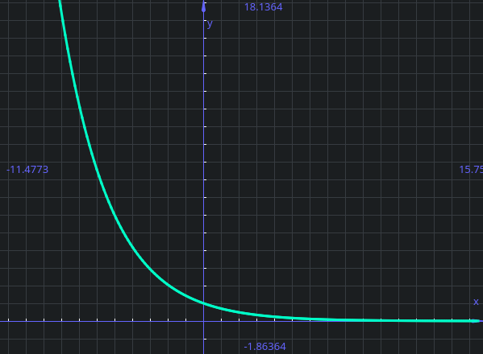

!!! definition "Limite"
    Dato l'insieme $A \subset \reals$, la funzione $f: A \rightarrow \reals$ ed $x_0$ [punto di accumulazione](../calcoloDifferenziale#punti-di-accumulazione) per A,  
    $L \in \bar \reals$ è il limite per _x che tende a_ $x_0$ di $f(x)$ (scritto $\lim_{x \rightarrow x_0} f(x) = L$ )  
    se $\forall V$ intorno di $L$ (ovvero sull'asse delle y) esiste $u$ intorno di $x_0$ (il punto sulle x) tale che $x \in u \cap A \backslash \{x_0\} \Rightarrow f(x) \in V$  

    Quindi un x nell'intorno di U (e nel dominio della funzione), ma diverso dal punto $x_0$, "finisca" nell'intorno V di L, sull'asse delle y)  

    { loading=lazy height=100 style="height:400px" }

Questo significa che, dato un punto $x_0$ ed $L=f(x_0)$, quando mi muovo intorno ad $x_0$ vado a finire in un intorno di L.  

!!! tip "In tutto ciò NON ci interessa quanto vale la funzione nel punto $x_0$!"

Come per la continuità, prendiamo un intorno V di L e mi domando se esiste un intorno di $x_0$ tale che la funzione nell'intorno di $x_0$ va a finire nell'intorno di L determinato prima.  

??? info "Detto in un altro modo:"  
    $$
    \lim_{x \rightarrow a} f(x) = L \Leftrightarrow \forall \epsilon > 0 \; \exists \delta > 0 . (|x - a| < \delta \rightarrow |f(x) - L| < \epsilon)
    $$

!!! observation "Il limite può essere di un punto NON appartenente al dominio, basta sia di accumulazione"
    Nella definizione di limite non serve che $x_0$ sia nel dominio della funzione.  
    Basta che sia un [punto di accumulazione](../calcoloDifferenziale#punti-di-accumulazione) per il dominio (ovvero, un punto nel dominio o "_appiccicato_" al dominio).

Questa definizione vale quando $x_0$ e $L$ sono nei reali, che quando sono $\pm \infty$  

??? example "Dimostrazione della definizione con $x_0$ ed $L$ $\in \reals \cup {\pm \infty}$"
    === "$x_0 \in \reals, \; L \in \reals$"
        L'intorno $u$ di $x_0$ è $V=(x_0 - \delta, x_0 + \delta)$ come da definizione  
        E, sempre da definzione, $V$ intorno di $L$ (sulle y) è $V= (L - \epsilon, L + \epsilon)$  
        Possiamo quindi dire $x \in u$ (con $|x-x_0| < \delta$) e $f(x) \in V$ (ovvero $f(x_0)-\epsilon < f(x) < f(x_0) + \epsilon$ )  
        La definizione quindi è questa:  

        $$
        \lim_{x \rightarrow x_0} f(x) = L \Leftrightarrow \forall \epsilon > 0 \; \exists \delta > 0 \; . \; \biggr(x \in A, |x - x_0| < \delta \text{ e } x \ne x_0 \rightarrow |f(x) - f(x_0)| < \epsilon \biggr)
        $$

    === "$x_0 \in \reals, \; L = + \infty$"
        Stavolta, $V$ intorno di $+ \infty$ (sulle y) è una semiretta $V= (a, + \infty)$  
        Quindi $f(x) \Leftrightarrow f(x) > a$ (infinito è più grande di ogni numero reale a)  

        $$
        \lim_{x \rightarrow x_0} f(x) = + \infty \Leftrightarrow \forall a \in \reals \; \exists \delta > 0 \; . \; \biggr(x \in A, |x - x_0| < \delta \text{ e } x \ne x_0 \rightarrow f(x) > a \biggr)
        $$

    === "$x_0 \rightarrow + \infty, \; L \in \reals$"
        Quando la funzione ad infinito ha un numero nei reali, stiamo semplicemente dicendo che c'è un valore di x oltre il quale, anche se x assume un valore più grande a numero reale,

        $$
        \lim_{x \rightarrow + \infty} f(x) = L \Leftrightarrow \forall \epsilon > 0 \; \exists a \in \reals \; . \; \biggr(x > a \rightarrow |f(x) - L | < \epsilon \biggr)
        $$

    === "$x_0 \rightarrow + \infty, \; L \in + \infty$"

        $$
        \lim_{x \rightarrow + \infty} f(x) = + \infty \Leftrightarrow \forall a \in \reals \; \exists b \in \reals \; . \; \biggr(x > b \rightarrow f(x) > a \biggr)
        $$
    
    Ovviamente le stesse cose valgono anche con $- \infty$

### Parallelismo con la continuità

Il concetto di limite è molto simile a quello di continuità.  
La differenza principale è che:  

- Nel limite non guardiamo il punto $x_0$ ma il suo intorno.  
    Inoltre consideriamo solo i punti di accumulazione (quindi anche punti esterni al dominio (come 0 con la funzione $\frac 1 x$). Inoltre non consideriamo i punti isolati in quanto non sono di accumulazione)
- Nella continuità guardiamo il valore $x_0$ ed un suo intorno, considerando ogni punto nel domino (quindi anche i punti isolati)

Inoltre nella continuità $x_0$ può essere uguale ad x, quindi $x_0 = x \Rightarrow f(x) - f(x_0) = 0$  

La definizione di limite e continuità infine possono essere viste compatibili se (oltre al requisito $x \ne x_0$) si scambiano tra di loro L ed $x_0$

## Teorema dell'unicità del limite

!!! theorem "Teorema dell'unicità del limite"
    Se il limite esiste, allora è unico.  
    Questo perché dire che una funzione tende ad un valore $L_1$ per x che tende a $x_0$ significa che si avvicina a quel valore quando x si avvicina a $x_0$, quindi non può tendere contemporaneamente ad $L_2$ perché non può avvicinarsi a due valori distinti contemporaneamente.  

## Limiti destri e sinistri

!!! definition "Definzione di limite destro e sinistro"
    $A \subset \reals, x_0 \in Acc(A), x_0 in \reals$  
    $f: A \rightarrow \reals$,  l in $\bar \reals$ è il limite di f(x) per x che tende a $x_0$ da destra e si scrive

    $$
    \lim_{x \rightarrow x_0^+} f(x) =f
    $$

    Se $\forall V$ intorno di l esiste $\delta >0$ tale che $x_0 < x < x_0 + \delta, x \in A \Rightarrow f(x) \in V$.  
    Qui si possono notare due cose:

    1. Il fatto che x sia diverso da $x_0$ si può osservare dall'uso del minore stretto (quindi non mi interessa neanche in questo caso quanto vale la funzione del punto)
    2. Il motivo per il quale $x_0$ è finito (in $\reals$) è perché non ha senso avvicinare $+\infty$ da destra

    ---

    Da sinistra, se $x_0 - \delta < x < x_0, x \in A \Rightarrow f(x) \in V$

Questo significa che nella definizione di limite, si considerano solo i "_mezzi intorni_" a desta o a sinistra  

??? example "Esempio di limite da destra e da sinistra"
    Prendendo la funone $f: (-\infty, 0) \cup (0, + \infty) \rightarrow \reals$  
    Definita come  
    $f(x)= \begin{cases}
    -1 \text{ se } x < 0 \\
    1 \text{ se } x > 0
    \end{cases}$  

    { loading=lazy }

    In questo caso, il limite per x che tende a 0 da destra di f(x) vale 1 ($\lim_{x \rightarrow 0^+} f(x) = 1$) e quello che tende a 0 da sinistra -1 ($\lim_{x \rightarrow 0^-} f(x) = -1$).  
    
    In questo caso non esiste il limite per f(x) che tende a 0, perché il limite che tende a 0 da destra è diverso dal limite per x che tende a 0 da sinistra.  

!!! observation "Il limite esiste solo se i limiti da destra e da sinistra sono uguali"
    $$
    \lim_{x \rightarrow x_0} f(x) = L \Leftrightarrow \lim_{x \rightarrow x_0^+} f(x) = \lim_{x \rightarrow x_0^-} f(x) = L
    $$
    
    Nella definzione di limite destro si usa solo il "_mezzo intorno_" destro e stessa cosa con quello sinistro.  
    Se vengono messi insieme si ottiene la definizione di limite.  

### Funzione definitivamente positiva e negativa

!!! definition "Funzione definitivamente positiva e negativa"
    $A \subset \reals, f: A \rightarrow \reals, x_0 \in Acc(A)$  
    Si dice che $\lim_{x \rightarrow x_0} f(x) = L^+$ (con $L \in \reals$), se:  

    1. $\lim_{x \rightarrow x_0} f(x) = L$
    2. Esiste u intorno di $x_0$ tale che $x \in u \cap A \{x_0\} \Rightarrow f(x) > L$  

    Ciò significa che la funzione "tende" al valore ma da 'sopra':  
    

    La stessa definizione vale per $L^-$

??? example "Esempio di limite positivo"

    $$
    f(x) = \frac 1 x \qquad \lim_{x \rightarrow + \infty} f(x) = 0^+
    $$

    { loading=lazy }

    Questo perché considerare la funzione vicino $+ \infty$, la funzione tende a 0.  
    Scegliendo una semiretta (e quindi un intervallo $(a, + \infty)$) come intorno u  
    $a > 0 \Rightarrow f(x) > 0$ (in questo caso 0=l), e quindi possiamo dire che la funzione è definitivamente positiva  
    In questo caso a noi interessa che la funzione sia positiva in un intorno del punto di cui calcoliamo il limite

### Teorema della permanenza del segno

!!! definition "Teorema della permanenza del segno"
    $A \subset \reals, f: A \rightarrow \reals, x_0 \in Acc(A)$  
    Se esisiste $\lim_{x \rightarrow x_0} f(x) = L \in \bar \reals$ e $L \ne 0$
    allora esiste un intorno u di $x_0$ tale che se $x \in A \cap u \{x_0\}$ allora f ha lo stesso segno di L.  

[44:00]

### Continuità di una funzione a destra o sinistra

!!! definition "Funzione continua a destra o sinistra" 
    Dato $A \subset \reals, x+0 in A, x_0 \in Acc(A)$  
    Se $\lim_{x \rightarrow x_{0^+}} f(x) = f(x_0)$, allora si dice che f è continua a destra in $x_0$.  
    Se $\lim_{x \rightarrow x_{0^0-} f(x) = f(x_0)$, allora si dice che f è continua a sinistra in $x_0$.  

??? example "Funzione continua a destra o sinistra"
    Riprendendo l'esempio della funzione vista prima e modificandola appena, di dà la seguente funzione:  
    $f(x)= \begin{cases}
    -1 \text{ se } x < 0 \\
    1 \text{ se } x > 0
    \end{cases}$  

    In questa funzione, il limite per x che tende a $0^+$ vale quanto la funzione a 0.  
    Quando la funzine presenta questo comportamento, viene detta funzione continua a destra.  
    Ovviamente lo stesso discorso vale anche per il discorso "a sinistra"  

## Teorema di confronto

!!! definition "Teorema di confronto" 
    $A \subset \reals, x_0 \in Acc(A), f,g: A \rightarrow \reals$  
    Se esistono $\lim_{x \rightarrow x_0} f(x) = L_1$ e $\lim_{x \rightarrow x_0} g(x) = L_2$  
    Se esiste u intorno di $x_0$ tale che $x \in u \cap A \backslash \{x_0\} \Rightarrow f(x) \le g(x)$, allora $L_1 \le L_2$.  

Ovvero, se si hanno due funzioni in cui nel grafico una delle due funzioni assume valori maggiori allo stesso punto, la disuguaglianza "_passa_" al limite. Nelle ipotesi corrette quindi:  

$$
f(x) \le g(x) \Rightarrow \lim_{x \rightarrow x_0} f(x) \le \lim_{x \rightarrow x_0} g(x)
$$

!!! observation "Il teorema non funziona con minore/maggiore stretto"
    Se $f(x) > g(x)$ potrei concludere che $\lim_{x \rightarrow x_0} f(x) < \lim_{x \rightarrow x_0} g(x)$?  
    No, perché prendendo ad esempio le funzioni $g(x) = \frac 1 x$ e $f(x) = - \frac 1 x$ su $x > 0$, entrame le funzioni tendono a 0; ed ecco che una disuguaglianza stretta diventa debole.  
    Quindi $f(x) < g(x) \Rightarrow \lim_{x \rightarrow x_0} \lim_{x \rightarrow x_0} f(x) \le \lim_{x \rightarrow x_0} g(x)$  
    
    Le disuguaglianze passano quindi al limite ma diventano deboli.  

## Teorema dei carabinieri

!!! definition "Teorema di dei carabinieri"
    $A \subset \reals, x_0 \in Acc(A), f,g, h: A \rightarrow \reals$  
    Se esistono $\lim_{x \rightarrow x_0} f(x)= L$ e $\lim_{x \rightarrow x_0} h(x)= L$ (L in questo caso ha lo stesso valore).  
    Se esiste un intorno $u$ di $x_0$ tale che $x \in A \cap u \backslash \{x_0\} \Rightarrow f(x) \le g(x) \le h(x)$, allora esiste $\lim_{x \rightarrow x_0} g(x) = L$ 

Ovvero, se abbiamo tre funzioni, dall'esistenza dei limiti di f ed h (uguali tra loro) deduco che esiste il limite di g.  
Rispetto al teorema di confronto, dove si sa che i limiti delle funzioni g ed h esistono, in questo caso non so se esiste il limite di G ma sapendo che la funzione è compresa tra due funzioni ed il limite delle due funzioni è L, deduco che il limite di g sia L.  

!!! observation "Uso di "metà" del teorema"
    Se la funzione di sinistra va a $\pin$, spinge a $\pin$ tutto quanto (quindi ogni funzione alla destra della disequazione non può che essere qualcosa che va a più infinito).  
    Lo stesso concetto lo ho quando la parte della disequazione più a sinistra va a $\min$  
    Ho bisogno di entrambe le metà quando il limite è un numero finito ed ho bisogno delle altre funzioni per "schiaccia" sia da sopra che da sotto la funzione in mezzo.  

## Teorema di somma e prodotto di limiti

!!! definition "Teorema di somma e prodotto di limiti"
    $A \subset \reals, x_0 \in Acc(A), f,g: A \rightarrow \reals$  
    Supponiamo esistano i limiti $\lim_{x \rightarrow x_0} f(x) = L_1$ e $\lim_{x \rightarrow x_0} g(x) = L_2$ con $L_1, L_2 \in \bar \reals$  
    Allora:  

    1. Se ha senso $L_1 + L_2$, allora esiste $\lim_{x \rightarrow x_0} (f+g)(x) = L_1+L_2$
    2. Se ha senso $L_1 \cdot L_2$, allora esiste $\lim_{x \rightarrow x_0} (f \cdot g)(x) = L_1 \cdot L_2$

## Casi di indeterminazione

Il "Se ha senso" nella definizione precedente serve per escludere i **casi di indeterminazione**:

- $+ \infty \cdot - \infty$ e viceversa
- $\pm \infty \cdot 0$

### Esempi di casi di indeterminazione

??? example "Somma di $+ \infty$ con $- \infty$"
    Ponendo $f(x) = 2x$ e $g(x) = -x$  
    Le due funzioni hanno i limiti che a $+ \infty$ valgono rispettivamente $+ \infty$ e $- \infty$.  
    La loro somma è quindi questa:  

    $$
    \lim_{x \rightarrow + \infty} (f + g)(x) = \lim_{x \rightarrow + \infty} (2x - x) = \lim_{x \rightarrow + \infty} x = + \infty
    $$

    In questo caso avremmo che $(+ \infty) + (- \infty) = + \infty$

    Se invece prendo $f(x) = \frac x 2$ e $g(x) = -x$, allora i rispettivi termini per x che tende a $+ \infty$ varranno $+ \infty$ e $- \infty$  
    Ma se proviamo a fare il discorso che abbiamo appena fatto:  

    $$
    \lim_{x \rightarrow + \infty} (f + g)(x) = \lim_{x \rightarrow + \infty} (\frac x 2 - x) = \lim_{x \rightarrow + \infty} - \frac x 2 = - \infty
    $$

    In questo caso avremmo che $(+ \infty) + (- \infty) = - \infty$  

    Dato che il risultato di una somma deve essere costante, scegliamo di trattare le operazioni tra infiniti come casi particolari e quindi di non risolverle algebricamente.  
    Non ha senso parlare di somma.  
    Per questo motivo $(+ \infty) + (- \infty)$ non ha senso e si dice che il limite è indeterminato.  

    ---

    Il prodotto $0 * + \infty$ si considera allo stesso modo rispetto alla somma:  
    Considerando la funzione $f(x) = \frac 1 x$ (che tende a 0) e la funzione $g(x) =x$, che tende a $+ \infty$

    $$
    \lim_{x \rightarrow + \infty} (\frac 1 x \cdot x) = \lim_{x \rightarrow + \infty} 1 = 1
    $$

    Ed in questo caso avremmo $(0) \cdot (+ \infty) = 1$  

    Prendendo invece $f(x) = \frac 1 x$ (che tende a 0) e la funzione $g(x) =x^2$, che tende a $+ \infty$

    $$
    \lim_{x \rightarrow + \infty} (f \cdot g)(x) = \lim_{x \rightarrow + \infty} (\frac 1 x \cdot x^2) = \lim_{x \rightarrow + \infty} x = + \infty
    $$

    Quindi avremmo $0 \cdot (+ \infty) = + \infty$.  
    Quindi $0 \cdot (+ \infty)$ non ha senso.  

### Risoluzione dei casi di indeterminazione

!!! theorem "Una funzione che tende ad un numero finito è limitata"
    $A \subset \reals, x_0 \in Acc(A), f: A \rightarrow \reals$  
    Se esiste $\lim_{x \rightarrow x_0} f(x) = L$ e $L \in \reals$ ($L$ non è $\pm \infty$), allora f è limitata in un intorno di $x_0$.  
    Ovvero esiste un intorno $u$ di $x_0$ ed $\exists M \in R, M > 0$ tale che $x \in u \cap A \Rightarrow |f(x)| \le M$

Quindi una funzione che tende ad un numero finito, vicino al punto deve essere finita (limitata).  

??? example "Esempio di funzione limitata che tende a 0"
    $f(x) = \frac 1 x$ è limitata in un intorno di $+ \infty$ perché ($\lim_{x \rightarrow + \infty} f(x) = 0$

    E da un certo punto in poi la funzione sta tra $\pm M$, dato che la funzione tende ad un numero finito (e quindi da un certo punto in poi è finita, essendo la funzione limitata)

    

#### Funzione infinitesima

!!! definition "Funzione infinitesima, divergente e convergente"
    Se $\lim_{x \rightarrow x_0} f(x) = 0$, allora si dice che f è **infinitesima** per x che tende a $x_0$.  
    Se $\lim_{x \rightarrow x_0} f(x) = + \infty$, si dice che f diverge positivamente per x che tende ad $x_0$.  
    Se $\lim_{x \rightarrow x_0} f(x) = - \infty$, si dice che f diverge negativamente per x che tende ad $x_0$.  
    Se $\lim_{x \rightarrow x_0} f(x) = L$ e $L \in \reals$, f converge a L per x che tende ad $x_0$.  

!!! observation ""
    Se f è limitata inferiormente in un intorno di $x_0$ e $\lim_{x \rightarrow x_0} g(x) = + \infty$, allora il limite per $\lim_{x \rightarrow x_0} (f+g)(x) = + \infty$.  
    Se f è limitata superiormente in un intorno di $x_0$ e $\lim_{x \rightarrow x_0} g(x) = - \infty$, allora il limite per $\lim_{x \rightarrow x_0} (f+g)(x) = - \infty$.  
    Se f è limitata superiormente in un intorno di $x_0$ e $\lim_{x \rightarrow x_0} g(x) = 0$, allora il limite per $\lim_{x \rightarrow x_0} (f \cdot g)(x) = 0$.  
    Una funzione infinitestima per una limitata è una funzione infinitesima  

La somma f + g è indeterminata quando una funzione va a + infinito ed una a - infinito; quindi mi basta che la funzione sia limitata inferiormente (perché è un caso in cui la funzione non va a - infinito) per dire che la somma va a più infinito (e viceversa).  
Nel caso di prodotto di una funzione limitata per una infinitesima: per rimuovere l'indeterminazione mi "basta dire" che la seconda funzione è limitata.  

!!! observation "Tutte queste cose appena evidenziate derivano dal teorema dei carabinieri"

??? example "Esempio: Applicazione del teorema sul limite della somma con funzioni senza limite"
    Prendendo la funzione $\limit {+ \infty} x + sin(x)$, possiamo scomporla in due:  
    $\limit {+ \infty} x = + \infty$  
    $\limit {+ \infty} sin(x)$ che non esiste  
    In questo caso non si può applicare il teorema sul limite della somma (che richede che entrambi i limiti esistano).  
    Tuttavia sin(x) è una funzione limitata inferiormente; Quindi:  

    $$
    \limit \pin x + sin(x) = \pin
    $$

    Questo perché $x-1 \le x+sin(x)$ (perché $sin(x)$ è limitat inferiormente): per il teorema dei carabinieri $x-1$ tende a $\pin$, quindi anche $x + sin(x)$ tende a $\pin$.

## Limite del reciproco

!!! proposition "Limiti dei reciproci"
    Se $\limit {x_0} f(x)= 0^+$ allora $\limit {x_0} \frac 1 {f(x)} = \pin$  
    Se $\limit {x_0} f(x) = 0^-$ allora $\limit {x_0} \frac 1 {f(x)} = \min$  
    Se $\limit {x_0} f(x) = \pin$ allora $\limit {x_0} \frac 1 {f(x)} = 0^+$  
    Se $\limit {x_0} f(x) = \min$ allora $\limit {x_0} \frac 1 {f(x)} = 0^-$  
    Se $\limit {x_0} f(x) = L$ con $L \ne 0, \pin, \min$ allora $\limit {x_0} \frac 1 {f(x)} = \frac 1 L$  

Questa proposizione ci dice che il limite del reciproco di una funzione (ammesso che sia definita), è il reciproco del limite:  
Se f tende a L, $\frac 1 f$ tende a $\frac 1 L$

$$
\displaylines{
f \rightarrow L \Rightarrow \frac 1 f \rightarrow \frac 1 L \\
\frac 1 {0^+} = \pin, \quad \frac 1 {0^-} = \min, \quad \frac 1 \pin = 0^+, \quad \frac 1 \min = 0^-
}
$$

## Esistenza dei limiti per funzioni monotone
!!! theorem "Esistenza dei limiti per funzioni monotone"
    $a, b \in \bar \reals, f: (a,b) \rightarrow \reals$ con f debolmente **crescente**.  
    In tal caso esistono:  

    - $\limit {a^+} f(x) = \inf_{x \in (a,b)} f(x)$
    - $\limit {b^-} f(x) = \sup_{x \in (a,b)} f(x)$

    

    L'opposto vale quando la funzione è debolmente decrescente (invertendo estremo superiore ed inferiore)

Avevamo visto che le funzioni monotone assumono massimo e minimo in un intervallo a destra se il dominio ha massimo ed il minimo a sinistra se il dominio ha minimo  
Questo teorema ci dice che in una funzione monotona i limiti esistono sempre.  

??? example "Esempio"

    $$
    \displaylines{
        f:(0,\pin) \rightarrow \reals \quad f(x) = - \frac 1 x \\
        \limit {0^+} - \frac 1 x = \min = \inf(f) \\
        \limit \pin - \frac 1 x = 0 = \sup(f)
    }
    $$

    

## Cambio di variabile

Per risolvere alcuni limiti che si presenteranno, può essere necessario effettuare un cambio di variabile.  
Un cambio di variabile è fatto quando si sostituisce una funzione (ad esempio $e^x$ con una variabile come $y$)  
Quando questo accade, è necessario cambiare anche il limite, per far sì che non perda di significato:  

$$
\lim \pin e^x = \lim_{y \to \pin} y
$$ 

## Limiti fondamentali

Esistono alcuni limiti fondamentali:  

### Somma e prodotto di limiti

- $\limit \pin x = \pin$  
- $\limit \pin x^n = (\lim_{n \rightarrow \pin} x) \cot (\lim_{n \rightarrow \pin} x) \cdot ...$ (questo è il teorema su prodotto di limiti) $=(\pin)\cdot (\pin) \cdot ... = \pin$
- $\limit \pin \frac 1 x = \frac 1 \pin = 0$
- $\limit \pin \frac 1 {x^n} = 0$

### Limiti di poliniomi

Un polinomio di grado n è qualcosa del tipo $p(x) = a_n \cdot x^n + a_{n-1} \cdot x^{n-1} + ... + a_{1} \cdot x + a_0$  
Dove $a_0, a_1, ..., a_n$ sono i coefficienti del polinomio e sono numeri reali ($a_0, a_1, ..., a_n \in \reals$).  
n è invece il grado del polinomio ($n \in \naturals$).  

??? example "Esempio di risoluzione di una forma indeterminata"
    Il limite ad infinito di un polinomio è spesso una forma indeterminata: $\lim \pin 3x^2 - 7x + 1 = \pin \min + 1$  
    Questa è quindi una forma indeterminata.  

    Per eliminarla:  

    $$
    \displaylines{
          \limit \pin 3x^2(1 - \frac 7x {3x^2} + \frac 1 {3x^2}) = \\
        = \limit \pin 3x^2(1- \frac 7 {3x} + \frac 1 {3x^2}) = \\
        = \pin(1- \frac 7 \pin + \frac 1 \pin) = \\
        = \pin (1 - 0 - 0) = \pin
    }
    $$

    Raccogliamo quindi il $3x^2$ e poi dividiamo, facendo infine il limite.  

Dato un polinomio possiamo quindi sempre raccogliere il monomio di grado più grande e poi dividere per lo stesso.  

$$
\displaylines{
        p(x) = a_nx^n + a_{n-1}x^{n-1} + ... + a_1x + a_0 =  \\
    = a_nx^n (1 + \frac {a_{n-1}} {a_n} \cdot \frac {x^{n-1}} {x^n} + ... + \frac {a_1} {a_n} \cdot \frac x {x^n} + \frac {a_0} {a_n} \cdot \frac 1 {x^n})
}
$$

A questo punto ho tutti termini che tendono a 0 se x tende a $\pin$ (o anche se x tende a $\min$).  
Quello che ottendo quindi è che $\limit \pin a_nx^n + a_{n-1}x^{n-1} + ... + a_1x + a_0 = \limit \pin a_nx^n$.  
Lo stesso discorso vale anche per quando x tende a $\min$.  

Quindi quando la variabile x tende a $\pm \infty$, il polinomio si comporta come si comporterebbe il monomio di grado più grande.  

??? example "Esempio di comportamento del poliniomio rispetto al suo grado maggiore"

    $$
        \limit \min -2x^5+3x^2 = \limit \min -2x^5 = -2(\min)^5 = (-2)(\min) = \pin
    $$

### Funzioni razionali

Una funzione razionale è una funzione $\frac {p(x)} {q(x)}$ dove p e q sono polinomi:  

$$
\displaylines{
    p(x) = a_n \cdot x^n + a_{n-1} \cdot x^{n-1} + ... + a_{1} \cdot x + a_0 \\
    q(x) = b_m \cdot x^m + b_{m-1} \cdot x^{m-1} + ... + b_{1} \cdot x + b_0 
}
$$

Quindi il limite della funzione sarà equivalemtne al conto che si fa con i polinomi:  

$$
\displaylines{
    \limit {\pm \infty} \frac {p(x)} {q(x)} = \\
    = \limit {\pm \infty} \frac {a_nx^n + a_{n-1}x^{n-1} + ... + a_1x + a_0} {b_mx^m + b_{m-1}x^{m-1} + ... + b_1x + b_0} \\
    = \limit {\pm \infty} \frac {a_nx^n} {b_mx^m}
}
$$

??? example "Esempio di funzioni razionali"

    $$
    \displaylines{
        \limit \pin \frac {7x^4 + 5x^2} {-2x^3 + x} = \\
        = \limit \pin \frac {7x^4} {-2x^3} = \\
        = \limit \pin \frac {7x} {-2} = \min
    }
    $$

    In questo caso abbiamo un eccesso di grado al numeratore (al numeratore abbiamo un grado 4, al denominatore abbiamo un grado 3), quindi il limite va a $\pm \infty$ a seconda del sengno dei coefficienti.  
    Se fosse successo l'opposto (il grado del denominatore suepriore al grado del numeratore), il limite sarebbe andato a 0  
    Se invece il grado fosse stato lo stesso, il limite sarebbe andato al rapporto dei coefficenti tra i termini di grado maggiore.  

### Altri limiti fondamentali

$$
\displaylines{
    \limit \pin e^x = \pin \\
    \limit \min e^x = 0^+ \\
    \limit {0^+} log(x) = \min \\
    \limit \pin log(x) = \pin \\
}
$$

### Limiti notevoli

- $\limit 0 \frac {sin(x)} x = 1$

Questo limite è una forma indeterminata, in quanto il $\limit 0 sin(x) = 0$, mentre il $\limit 0 x = 0$, tuttavi si può dimostrare che il limite faccia uno.  

??? tip "Dimostrazione - Da fare"
    //TODO - work in progress
    Guadando una circonferenza, può essere facile dire che la tangente è sempre più grande del seno per lo stesso valore di x (per il primo quadrante).  

    { loading=lazy}

    $$
    \displaylines{
          |sin(x)| \le x \le |tan(x)| = \\
        = |sin(x)| \le x \le |\frac {sin(x)}{cos(x)}| = \quad (\cdot \frac 1 {|sin(x)|})\\
        = \frac {|sin(x)|} {|sin(x)|} \le \frac x {sin(x)} \le \frac {|sin(x)|}{|cos(x)|} \cdot \frac 1 {|sin(x)|} = \\
        = 1 \le \frac x {sin(x)} \le \frac 1 {cos(x)} = \quad \text{ (inversione delle frazioni) }\\
        = 1 \ge \frac {sin(x)} x \ge cos(x) \\
        \\
        \limit 0 1 \ge \limit 0 \frac {sin(x)} x \ge \limit 0 cos(x) = \\
        = 1 \ge \limit 0 \frac {sin(x)} x \ge 1 \Rightarrow \limit 0 \frac {sin(x)} x = 1
    }
    $$

    

Da questo limite se ne possono poi dimostrare altri:  

- $\limit 0 \frac {1 - cos(x)}{x^2} = \frac 1 2$

??? example "Dimostrazione"
    
    $$
    \displaylines{
          \frac {1 - cos(x)}{x^2} = \frac {(1 - cos(x)) (1 + cos(x))}{x^2 (1 + cos(x))} \\
        = \frac {1 - cos^2 (x)} {x^2 (1 + cos(x))} = \frac {sin^2 (x)}{x^2 1 + cos(x)} = \\
        = \frac {sin(x)} x \cdot \frac {sin(x)} x \frac 1 {1 + cos(x)} \\
        \\
          \limit 0 \frac {sin(x)} x \cdot \frac {sin(x)} x \frac 1 {1 + cos(x)} = 1 \cdot 1 \cdot \frac 1 {1+1} = \\
        = \limit 0 \frac {1 - cos(x)}{x^2} = \frac 1 2
    }
    $$

- $\limit 0 \frac {e^x -1} x = 1$
- $\limit 0 \frac {log(1 + x)} x = 1$

---

- $\limit {0^+} x \cdot \log(x) = 0 \cdot (\min)$ (forma indeterminata)  
    Per questa si effettua il cambio di variabile, quindi $y=log(x), x = e^y$  
    Se $x \to 0^+ \Rightarrow y = log(x) \to \min$  
    $\lim_{y \to \min} e^y \cdot y$ (questa è ancora una forma indeterminata, $e^\min \cdot (\min) = 0^+ \cdot (\min)$)  
    Quindi è necessario fare un ulteriore cambio di variabile:  
    $z = -y$, quindi se $y \to \min \Rightarrow z \to \pin$  
    $\lim_{y \to \min} e^y \cdot y = \lim_{z \to \pin} e^{-z} \cdot -z = \lim_{z \to \pin} \frac {-z} {e^z} = 0$  
    $\lim_{x \to 0^+} x\cdot log(x) = 0$  

---

- $\limit {0^+} x^\alpha log(x)$ (con $\alpha > 0$); Anche in questo caso dobbiamo ricorrere alla sostituzione:  
    $y = x^\alpha$, quindi $x = y^{\frac 1 \alpha}$  
    Se $x \to 0 \Rightarrow y = x ^ \alpha \rightarrow 0$  
    $\limit {0^+} x^\alpha log(x) = \lim_{y \to 0^+} y \cdot log(y^{\frac 1 \alpha})$ $= \lim_{y \to 0^+} y \cdot \frac 1 \alpha log(y)$ $= \frac 1 \alpha \lim_{y \to 0^+} y \cdot log(y) = 0$

---

- $\limit {0^+} (1 + x)^{\frac 1 x} = \lim_{y \to 1} e^y = e^1 = e$

??? example "Dimostrazione"
    $\limit {0^+} (1 + x)^{\frac 1 x} = (1 + 0)^{\frac 1 0^+ } = 1^\pin$  
    Questa è una forma indeterminata:  
    $(1 + x)^{\frac 1 x} = e^{log(1 + x)^{\frac 1 x}} = e^{\frac 1 x log(1+x)}$  
    Da qui sostituiamo $y = \frac 1 x log(1 + x)$  
    Se $x \to 0^+$, a quanto deve tendere y?  
    $\limit {0^+} \frac 1 x log(1 + x) = 1$ (Limite notevole)  
    $\limit {0^+} (1 + x)^{\frac 1 x} = \lim_{y \to 1} e^y = e^1 = e$

#### Nuovi casi di indeterminazione

$f(x) > 0, \limit {x_0} f(x)^{g(x)}$.  
Quando questa è una forma indeterminata? Possiamo manipolare il limite per rendere la domanda più semplice:  
$f(x)^{g(x)}=e^{log(f(x)^{g(x)})} = e^{g(x) \cdot log(f(x))}$  
Abbiamo quindi spostato la domanda:  
quando è indeterminato il limite $\limit {x_0} g(x) \cdot log(f(x))$?  
Abbiamo 3 casi:  

1. $g \to 0, f \to \pin \So log(f) \to \pin$  
    $0 \cdot \pin$ quindi $(\pin)^0$ è indeterminata
2. $g \to 0, f\to 0^+ \So \log f \to \min$  
    $\So g \cdot \log(f) = 0 \cdot (\min)$
3. $g \to \pm \infty, f \to 1$, quindi $log(f) \to 0$  
    $g \cdot log(f) = \pm \infty \cdot 0$  
    $(1)^{\pm \infty}$ è indeterminata

Abbiamo quindi 4 nuove forme indeterminate:  

$$
(\pin)^0, \qquad (0^+)^0, \qquad (1)^{\pin}, \qquad (1)^{\min}
$$

Tutti e quattro i casi si risolvono riscrivendoli nella forma esponenziale  

??? example "Esempio"
    $\limit {0^+} x^x = \limit {0^+} e^{log(x^x)} = $  
    $=\limit {0^+} e^{x \cdot log(x)} = e^0 = 1$  

    Qui è stato "nascosto" il cambio di variabile, che sarebbe stato $y = x \cdot log(x)$, se $x \to 0^+ \So y \to 0$ $\So \lim_{y \to 0} e^y = e^0 = 1$

### Esponenziale

Dato $\limit \pin a^x$, ci sono 3 possibili soluzioni:  

$$\limit \pin a^x = \begin{cases}
\pin    & \text{ se } a > 1
1       & \text{ se } a = 1
0^+     & \text{ se } 0 < a < 1
\end{cases}
$$

Ovviamente a deve essere maggiore di 0  
Se invece vogliamo far tendere $x \to \min$, possiamo effettuare un cambio variabile: $y = -x$, quindi se $x \to \min \Rightarrow y \to \pin$.  
Di conseguenza: $\limit \min a^x = \lim_{y \to 1} a^-y = \lim_{y \to \pin} \frac 1 {a^y}$  
Quindi abbiamo di nuovo 3 casi:  

$$
\lim_{y \to \pin} \frac 1 {a^y} = \begin{cases}
0^+     & \text{ se } a > 1
1       & \text{ se } a = 1
\pin    & \text{ se } 0 < a < 1
\end{cases}
$$

I risultati sono anche facilmente visibili:  

|$a >1$|$0<a<1$|
|:----:|:-----:|
|{ loading=lazy }|{ loading=lazy }|

### Potenze

Consideriamo $\alpha \in \reals$ e quindi $x^\alpha$  

!!! observation
  Notare che se si consdiera $x^\alpha$ con $\alpha$ non razionale, si è forzati a prendere $x>0$ (è pari o dispari $\pi$?)  

Quindi, $\limit \pin x^\alpha$ vale:  

$$
\limit \pin x^\alpha = \begin{cases}
\pin    & \text{ se } \alpha > 0 \\
1       & \text{ se } \alpha = 0 \\
0^+     & \text{ se } \alpha < 0 
\end{cases}
$$

## Limite della composizione di funzioni

!!! theorem "Teorema del Limite della composizione di funzioni"
    $A, B \subset \reals, f: A \rightarrow B, g: B \rightarrow \reals$  
    $x_0 \in Acc(A)$  
    Se esiste $\limit {x_0} f(x) = y_0$, e $y_0 \in Acc(B)$ e $\exists \lim_{y \rightarrow y_0} g(y) = L \in \bar \reals$  
    E se è verificata almeno una delle seguenti due ipotesi: 

    - $y_0 \in B$ e g è continua in $y_0$
    - $\exists u$ intorno di $x_0$ tale che $x \in u \cap A \backslash \{x_0\} \Rightarrow f(x) \ne y_0$

    Allora $\limit {x_0} (g \circ f)(x) = L$, dove L è il limite di g  

Quindi $\limit {x_0} (g \circ f)(x) = \lim_{y \rightarrow y_0} g(y)$  

??? example "Esempio dell'uso del teorema"
    Calcoliamo $\limit \min arctg(x^2)$  
    
    Il limite è una composizione:  
    $f(x) = x^2$, $g(y) = arctg(y)$  
    $(g \circ f)(x) = g(f(x)) = g(x^2) = arctg(x^2)$  
    $x_0 = \min$, $y_0 = \limit {x_0} f(x) = \limit \min x^2 = \pin$  

    A questo punto dobbiamo rendeci conto del caso in cui ci troviamo:

    - Il primo caso non è verificato in quanto $y_0 = \pin$ e non appartiene al dominio di g  
    - Il secondo caso è verificato, perché $f(x) \ne y_0 \Rightarrow f(x) \ne \pin$, che è sempre vero.

    Procediamo quindi applicando il teorema:  
    $\lim_{y \to y_0} g(y) = \lim_{y \to \pin} arctg(y) = \frac \pi 2$  
    Quindi $\limit \min arctg(x^2) = \frac \pi 2$

!!! observation "Osservazione: la soluzione appena vista è un teorema di cambiamento di variabile"
    Riprendendo l'esempio appena visto, siamo partiti da $\limit \min arctg(x^2)$.  
    Cambiamo poi variabile e poniamo $y=x^2$, tuttavia troviamo la x anche come argomento del limite (che tende a $\min$).  
    Quindi se $x \to \min$ a quanto tende y?  
    Basta fare $\limit \min y = \limit \min x^2 = \pin$  

    Cambiando variabile otteniamo quindi:  
    $\limit \min arctg(x^2) \Rightarrow \lim_{y \to \pin} arctg(y) = \frac \pi 2$

La seconda ipotesi nel teorema necessaria perché se la composizione tra due funzioni va a toccare in modo _insistente_ il punto limite, dato che il secondo limite non si interessa di quanto valga la funzione nel centro dell'intorno, e dato che la funzione f va solo nel centro dell'intorno "non si può accorgere di quel che sta succedendo(?)"  

??? example "Uso dell'ipotesi due nel problema"
    $f: \reals \to \reals \quad f(x) = 1 \quad \forall x \in \reals$  
    $x_0 = 0$  
    $g(x) = \begin{cases}
    3 \text{ se } y=1 \\
    5 \text{ se } y \ne 1 \\
    \end{cases}$  
    $g: \reals \to \reals$  
    $(g \circ f)(x) = g(f(x)) = g(1) = 3 \forall x \in \reals$  
    Quindi la funzione $(g \circ f)(x)$ è sempre 3.  
    Il limite di una funzione costante è quindi una costante:  
    $\limit 0 (g \circ f)(x) = 3$  
    
    Prendendo poi come $y_0 = \limit {x_0} f(x) = \limit 0 f(x) = 1$, e quindi:  
    $\limit {x_0} (g \circ f)(x) \ne \lim_{y \to y_0} g(y)$  
    Però non vale nessuna delle due ipotesi  

## Confronti tra infiniti
Dato un limite del tipo $\limit \pin \frac {a^x}{x^\alpha}$, abbiamo:  

$$\limit \pin \frac {a^x}{x^\alpha} = \begin{cases}
\pin    & \text{ se } a > 1
0^+     & \text{ se } 0< a < 1
\end{cases}
$$

Se $a=1 \Rightarrow a^x = 1$, quindi $\lim \pin \frac {a^x}{x^\alpha} = \limit \pin \frac 1 {x^\alpha}$  
Quindi quello che domina i limite è l'a al numeratore, ovvero l'esponenziale, che vince sulla potenza.  

L'unico caso in cui l'esponenziale non guida la funzione è quando a è pari ad 1.  

??? example "Esempio"
    $a=\frac 1 2 \quad \alpha = -3$  
    
    $$
    \limit \pin \frac {a^x}{x^\alpha} = \limit \pin \frac {(\frac 1 2)^x} {x^{-3}} = \limit \pin \frac {x^3}{2^x} = 0^+
    $$

    Anche in questo caso quello che domina il limite è l'esponenziale (il $2^x$ al denominatore), che è molto più veloce rispetto alla potenza  

### Confronto tra logaritmo e potenza

Quando abbiamo a che fare con un logaritmo, conviene usare il cambio di variabile e sostituirlo (come mostrato nell'esempio)  

??? example "Esempio: cambio di potenza del logaritmo"
    $\limit \pin \frac {log(x)} x$, quindi facciamo il cambio di variabile $y = log(x)$ (e quindi $x = e^x$ una volta effettuato il cambio variabile nel limite)  
    Se $x \to \pin \Rightarrow \limit \pin log(x) = \pin$ $( y = log(x) \to \pin)$ 

    $\limit \pin \frac {log (x)} x = \lim_{y \to \pin} \frac y {e^y} = 0$ 

    ---

    $\limit \pin \frac { (log(x))^\beta }{x^\alpha}$,  $\alpha, \beta \in \reals$,  $\alpha, \beta > 0$  
    Anche in questo caso iniziamo con il cambio di variabile $y = log(x) \Rightarrow x=e^y$  
    Quindi se $x \to \pin$ (se x tende a $\pin$), $\Rightarrow y \to \pin$ (allora anche y tende a $\pin$)  
    Risostituiamo inoltre x con $e^y$  

    $\limit \pin \frac { (log(x))^\beta }{x^\alpha} = \lim_{y \to \pin} \frac {y^\beta}{(e^y)^\alpha} =$  
    $=\lim_{y \to \pin} \frac {y^\beta}{(e^{y \cdot \alpha}} = \lim_{y \to \pin} \frac {y^\beta}{(e^\alpha)^y} =$  
    Assegnamo quindi ad $a = e^\alpha$:  
    $\lim_{y \to \pin} \frac {y^\beta}{a^y}$  
    Da qui sappiamo che $\alpha > 0$ e quindi $e^\alpha > 1$  
    Questo limite ha quindi come risultato 0, perché l'esponenziale al denominatore porta a 0 il denominatore  

