Calcolo differenziale - funzioni 

## Insiemi numerici
Introduciamo il concectto di insiemi numerici; In questo caso ci limitiamo a trattarne 4:  
$\mathbb N$: Numeri interi non negativi (0, 1, 2, 3, ...)  
$\mathbb Z$: Numeri interi positivi e negativi (-2, -1, 0, 1, 2, ...)  
$\mathbb Q$: Numeri razionali (classi di equivalenza di frazioni $\frac{p}{q}$ con $p,q \in \mathbb Z, q \ne 0$ )  
$\mathbb R$: Numeri reali. Razionali e "non" (e.g. $\sqrt 2, \pi, e$)

## Intervalli

!!! definition "Intervalli di $\mathbb R$"
    $I \in \mathbb R$ si dice intervallo se $\forall x,y \in I$ con $x < y$, dato $z$ tale che $x < z < y$ risulta che $z \in I$

Ovvero dati due elementi, è possibile trovare un elemento "in mezzo" ai due, che a sua volta farà parte dell'intervallo.  

### Tipi di intervallo
Ci possono essere diversi tipi di intervallo

#### Aperto
In un intervallo aperto, scritto come `(a,b)`, gli estremi sono esclusi, quindi:  
$I = \{ x \in \mathbb R | a < x < b  \}$

#### Chiuso
In un intervallo chiuso, scritto come `(a,b)`, gli estremi sono inclusi, quindi:  
$I = \{ x \in \mathbb R | a \le x \le b  \}$

#### Semiaperto/semichiuso
Un intervallo semiaperto o semichiuso è un mix dei due tipi appena descritti, in cui i due estremi sono discordi:  

- $[a,b) = \{ x \in \mathbb R | a \le x < b \}$
- $(a,b] = \{ x \in \mathbb R | a < x \le b \}$

#### Semiretta
Esiste poi un ulteriore tipo di intervallo, chiamato semiretta, che include l'infinito come uno dei due estremi.  
Anche questo può essere sia chiuso, che aperto, e possono essere sia a destra che a sinistra.  
Una semiretta è aperta o chiusa si riferisce al termine razionale:  
Una **semiretta chiusa a destra**:  
$[a, + \infty ) = \{ x \in \mathbb R | a \le x \}$  
  
Una **semiretta aperta a sinistra**:  
$(- \infty, a) = \{ x \in \mathbb R | a > x \}$  

Con il simbolo $(- \infty, + \infty)$ si intende tutta la retta reale.

## Funzioni
Una funzione è una terna di oggetti $(A,B,f)$, dove:  
A e B sono insiemi e, A si dice dominio, B si dice codominio ed f è una legge che lega gli elementi di A a quelli di B.  
Il simbolo matematico è $f: A \rightarrow B$  
F mette in corrispondenza ogni elemento di A con uno ed un solo elemento di B.  

!!! definition "Immagine attraverso f"
    Data una funzione $f: A \rightarrow B$ e $D \subset A$ e $f(D) = \{ f(x) : x \in D \}$  
    $f(D)$ si dice immagine di D attraverso f.  
    $f(D) \subset B$  

!!! definition "Immagine"
    Quando si parla invece di immagine (di f), si intende immagine di tutto il dominio, quindi:  
    $Imm(f) = f(A)$  

### Funzioni surgettive ed iniettive

Vediamo quindi i concetti di surgettività ed iniettività:

#### Surgettività 

!!! definition "Surgettività"
    Una funzione $f: A \rightarrow B$ si dice surgettiva se
    $\forall y \in \exists \text{ almeno un elemento } x \in A$ tale che (t.c.) $f(x) = y$.  

Che significa che ogni elemento nel codominio "proviene" da un elemento del dominio (nel codominio non ci sono elementi "scoperti")

!!! observation "Cambiamento del dominio per rendere una funzione surgettiva"
    La funzione $g: \mathbb R \rightarrow \mathbb R$, $g(x) = x^2$ non è surgettiva.  
    Questo perché nessun numero razionale elevato al quadrato restituirà un valore negativo. La funzione non è quindi surgettiva  
    La stessa funzione ma definita come $g: \mathbb R \rightarrow [0, + \infty )$ è surgettiva.

Possiamo quindi dire che una funzione è surgettiva solo se la sua immagine coincide con il codominio.  

Per capire velocemente da un grafico se una funzione è surgettiva, possiamo pensare di tracciare una linea orizzontale, se non intercetta almeno una volta la funzione, questa non è surgettiva:  

<figure markdown>
  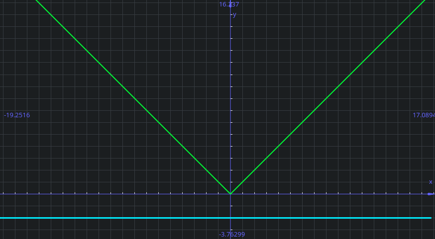{ loading=lazy }
  <figcaption markdown>
  La funzione **NON** è surgettiva poiché la retta orizzontale blu ($y=2$) non intercetta mai la funzione ($y=|x|$)
  </figcaption>
</figure>

#### Iniettività

!!! definition "Iniettività"
    Una funzione $f: A \rightarrow B$ si dice iniettiva se
    $\forall x_1,x_2 \in A \text{ con } x_1 \ne x_2 \text{ risulta che } f(x_1) \ne f(x_2)$  
    La funzione è monotona (cresce o decresce e basta; Non si "appiattisce)

Se una funzione non è iniettiva, ci possono comunque essere dei "trucchi" che ci consentono di farla diventare iniettiva, ad esempio scartando parte del dominio.  

!!! observation "Cambiamento del dominio per rendere una funzione iniettiva"
    La funzione $g: \mathbb R \rightarrow \mathbb R$, $g(x) = x^2$ non è iniettiva.  
    La stessa funzione ma definita come $g: [0, + \infty ) \rightarrow \mathbb R$ è iniettiva.

Per capire velocemente da un grafico se una funzione è iniettiva, possiamo pensare di tracciare una linea orizzontale, se questa intercetta più di una volta la funzione, questa non è iniettiva:  

<figure markdown>
  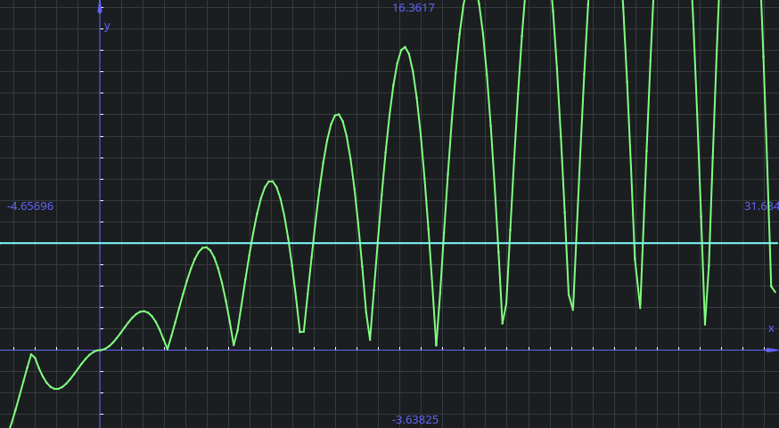{ loading=lazy }
  <figcaption markdown>
  La funzione **NON** è iniettiva poiché la retta orizzontale blu ($y=5$) intercetta più volte la funzione ($y=x\cdot |sin(x)|$ )
  </figcaption>
</figure>

#### Funzione bigettiva

!!! definition "Funzione bigettiva"
    una funzione $f$ si dice bigettiva/biunivoca/invertibile se è sia iniettiva che surgettiva

Se una funzione è bigettiva posso costruire la funzione inversa $f^{-1}: B \rightarrow A$.  
Datp un elemento $b \in B$ esiste un elemento $a \in A$ tale che $f(a) = b$ (perché f è surgettiva).
L'elemento a è unico perché f è iniettiva

quindi $f^{-1}(b)=a \Leftrightarrow f(a) = b$

La radice quadrata è la funzione inversa di f(x) = x^2 qunado dominio e codominio sono entrambi [0,+ \infty)
Che è come mai \sqrt 2 = 2 (che è diverso da dire che x^2 =4, che ha due soluzioni)
Per questo motivo \sqrt {x^2} = |x|

### Proprietà dai grafici

#### Tralaslazione
Possiamo traslare le funzioni sul grafico in ogni modo vogliamo:  
Prendendo una funzione come $(\frac{1}{2}x)^2$ :  
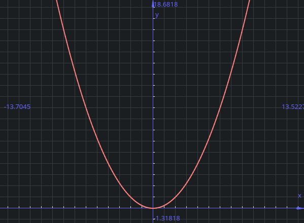{ loading=lazy }

Possiamo effettuare ogni traslazione desiderata:  

- **Traslazione verso l'alto**:  
    Abbiamo una traslazione verso l'alto quando al valore della funzione aggiungiamo un valore $n$.  
    Abbiamo quindi $f(x) + n \text{ con } n > 0$ (in questo caso $(\frac{1}{2}x)^2+5$)  
    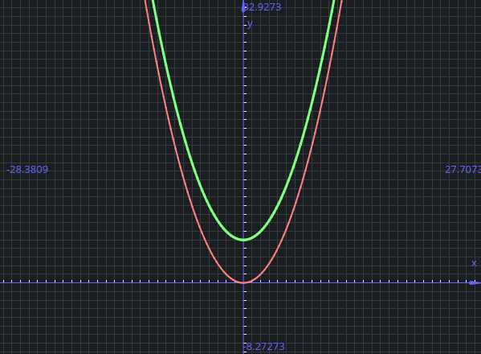{ loading=lazy, width=400 }
- **Traslazione verso il basso**:  
    Abbiamo una traslazione verso il basso quando al valore della funzione sottraiamo un valore $n$.  
    Abbiamo quindi $f(x) - n \text{ con } n < 0$ (in questo caso $(\frac{1}{2}x)^2-5$)  
    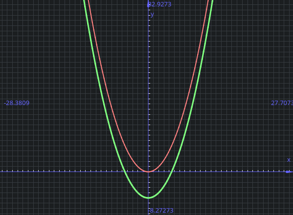{ loading=lazy, width=400 }
- **Traslazione verso sinistra**:  
    Abbiamo una traslazione verso sinistra quando all'argomento/valore della funzione aggiungiamo un valore $n$.  
    Abbiamo quindi $f(x+n)   \text{ con } n > 0$ (in questo caso $(\frac{1}{2}x+5)^2$)  
    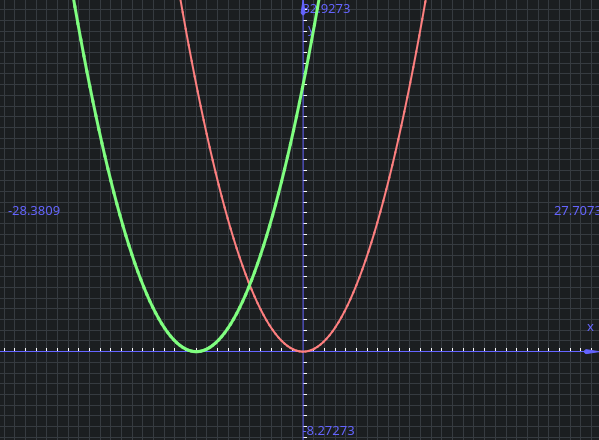{ loading=lazy, width=400 }
- **Traslazione verso destra**:  
    Abbiamo una traslazione verso destra quando all'argomento/valore della funzione sottraiamo un valore $n$.  
    Abbiamo quindi $f(x-n)   \text{ con } n < 0$ (in questo caso $(\frac{1}{2}x-5)^2$)  
    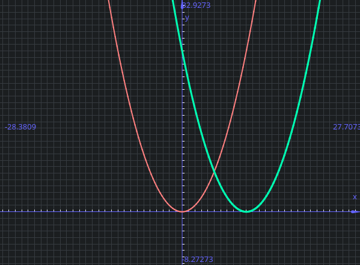{ loading=lazy, width=400 }

#### Valore assoluto
Il valore assoluto coincide con la funzione $f$ dove $f$ è positiva ed è l'opposto dove $f$ è negativa:  

<figure markdown>
  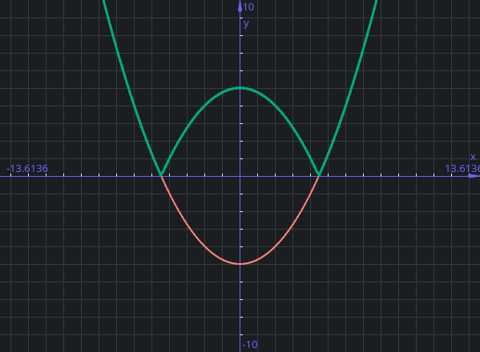{ loading=lazy }
  <figcaption markdown>

$$
|f(x)| =
\begin{equation}
    \begin{cases}
      f(x) \text{ quando } x \ge 0 \\
      -f(x) \text{ altrimenti}
    \end{cases}\,.
\end{equation}
$$

  </figcaption>
</figure>

#### Specchiamento

È possibile specchiare una funzione sia rispetto all'ascisse (sempre) che rispetto all'ordinata (quando il dominio è simmetrico rispetto all'origine).  

| Specchiamento        | Rispetto all'ascisse | Rispetto all'ordinata|
|:--------------------:|:--------------------:|:--------------------:|
| Grafico              | 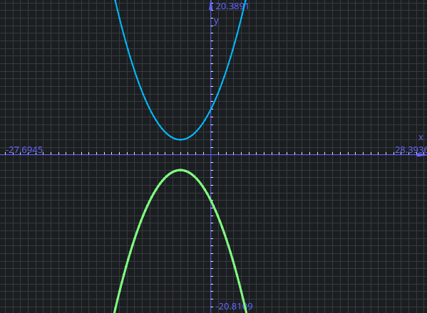{ loading=lazy } | 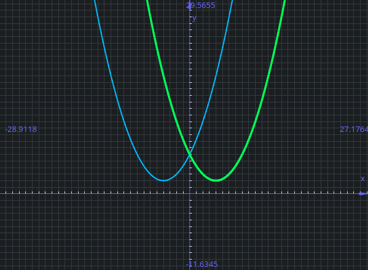{ loading=lazy } |
| Funzione             | $-f(x)$ | $f(-x)$ | 
| Esempio nel grafico  | $y=-((0.5 \cdot x+2)^2+2)$ | $y=(0.5 \cdot -x+2)^2+2$ | 

Notare che nello specchiamento rispetto all'ordinata, il dominio deve essere simmetrico rispetto all'origine, e quindi permettere lo specchiamento.

### Funzioni invertibili
Se f è una funzione invertibile, i grafici di $f$ e $f^{-1}$ sono simmetrici rispetto alla retta $y=x$  

<figure markdown>
  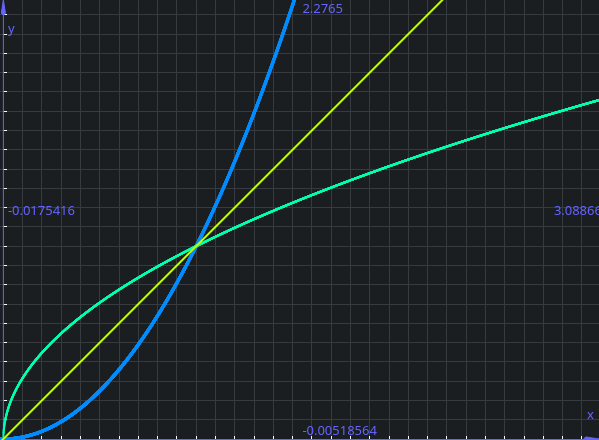{ loading=lazy }
  <figcaption markdown>
 In questo esempio, possiamo vedere come la funzione blu ($x^2$ ) e la funzione verde ($\sqrt{2}$) sono simmetriche rispetto alla retta gialla ($y=x$) 
  </figcaption>
</figure>

Se il punto (2,4) appartiene al grafico di f, allora il punto (4,2) appartiene al grafico di g

### Funzioni mònótòne
La monotonia è una proprietà che riguarda strettamente la crescenza o la decrescenza delle funzioni

!!! definition "Funzione monotona"
    Dati $A, B \subset \mathbb R \text{ e } x_1,x_2 \in A \text{ con } x_1 < x_2$  
    Se $\forall x_1,x_2$ risulta che:  

    1. $f(x_1) < f(f_2)$ : f si dice strettamente crescente
    2. $f(x_1) \le f(f_2)$ : f si dice debolmente crescente
    3. $f(x_1) > f(f_2)$ : f si dice strettamente decrescente
    4. $f(x_1) \ge f(f_2)$ : f si dice debolmente decrescente

    Se si verificano il caso 1 o 3, f si dice strettamente mònótòna
    Se si verificano il caso 2 o 4, f si dice debolmente mònótòna

Una funzione (debolmente) crescente quindi, aumenterà sempre di valore (o comunque non diminuirà) man mano che $x$ cresce. Per essere strettamente crescente, la funzione non deve avere mai due soluzioni uguali in due punti diversi.  
Per una funzione decrescente, vale lo stesso discorso, ma $x$ diminuirà sempre di valore invece di crescere.  

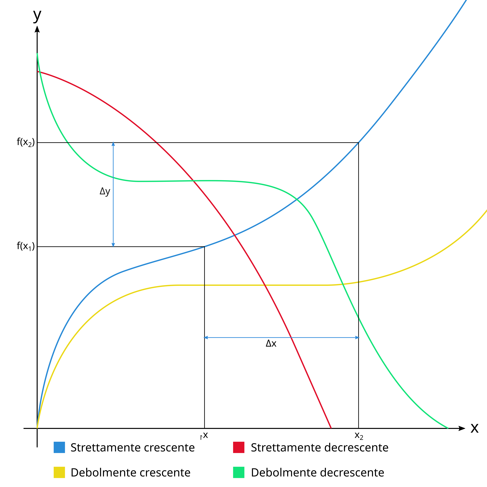{ loading=lazy }

Se una funzione ha un tratto "orizzontale", quella funzione non sarà strettamente monotona.  
Se una funzione è strettamente crescente/decrescente, lo sarà anche debolmente.  

!!! observation "Rapporto incrementale"
    $f$ è strettamente crescente se e solo se $\frac{f(x_1) - f(x_2)}{x_1 - x_2} > 0$ (questo è il rapporto incrementale, $\frac{\Delta X}{\Delta Y}$, che misura quanto $f$ si è spostata in rapporto a quanto è stata spostata l'ascissa in orizzontale). Ovviamente con $x_1 \neq x_2$.  
    Dire che una funzione è crescente significa dire che i rapporti incrementali sono positivi, e quindi che sia numeratore che denominatore sono concordi in segno. (Per lo "strettamente", occorre che il $\Delta Y$ sia diverso da 0). L'opposto vale per essere decrescente.  

<figure markdown>
  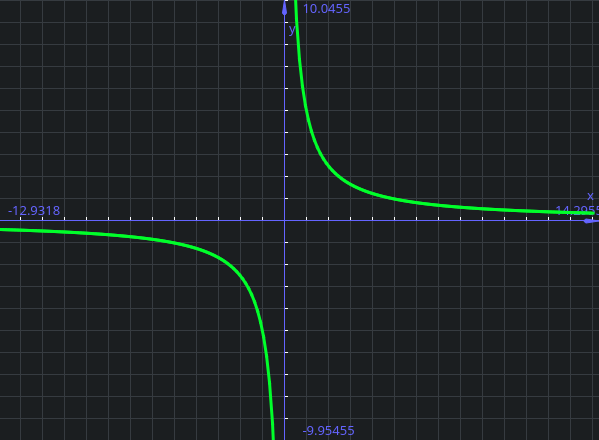{ loading=lazy }
  <figcaption markdown>
 Quando abbiamo una funzione come $\frac 1 x$, come definiamo la funzione?
  </figcaption>
</figure>

Nel caso della funzione $\frac 1 x$ (un ramo di iperbole), in alcuni punti della funzione le coppie $x_1$, $x_2$ mantengono l'ordinamento (ad esempio con $x_2 = 10$ e $x_1 = 5$, $f(x_1)>f(x_2)$), facendo risultare la funzione decrescente; in altre lo invertono (ad esempio per $x_2 = 20$ e $x_1 = -20$, avendo quindi $f(x_1) < f(x_2)$).  
Questo significa che questa funzione non è globalmente monotona, ma è decrescente su due intervalli:  
$f$ è decrescente $(- \infty, 0)$ e in $(0, \infty)$, ma non in tutto il suo dominio ($\mathbb R \backslash \{0\}$).  

#### Composizione di funzioni monotone

!!! proposition "Proposizione"  
    Avendo:  

    - $A,B,C \subset \mathbb R$
    - $f: A \rightarrow B$
    - $g: B \rightarrow C$

    Allora:

    - Se $f$ è crescente $\nearrow$ e $g$ è crescente $\nearrow$, allora $g \circ f$ (g composto f) è crescente $\nearrow$
    - Se $f$ è crescente $\nearrow$ e g è decrescente $\searrow$, allora $g \circ f$ è decrescente $\searrow$ (e viceversa)
    - Se $f$ è decrescente $\searrow$ e $g$ è decrescente $\searrow$, allora $g \circ f$ è crescente $\nearrow$

    Quindi:  

    - $\nearrow \circ \nearrow \ \Rightarrow \nearrow$
    - $\searrow \circ \searrow \ \Rightarrow \nearrow$
    - $\nearrow \circ \searrow \ \Rightarrow \nearrow$
    - $\searrow \circ \nearrow \ \Rightarrow \nearrow$

!!! definition "Insieme di definizione"
    L'insieme di definizione (o dominio naturale) di una funzione è il più grande sottoinsieme di $\mathbb R$ dove ha senso scrivere la funzione

Ad esempio nel caso di $\frac 1 x$ il dominio di definizione è $\mathbb \backslash \{0\}$

!!! definition "Funzione pari e dispari"
    Se $f(x) = f(-x) \forall x$ nel dominio di $f$, allora f si dice pari.  
    Se $f(x) = -f(-x) \forall x$ nel dominio di $f$, allora f si dice dispari.  

Questa definizione implica che il dominio di f sia tale che se x appartiene al dominio, allora anche -x appartiene al dominio (è simmetrico rispetto allo 0).  

!!! definition "Funzione periodica"
    $f$ si dice periodica di periodo $p$ con $p \in \mathbb R$ se $\forall x, f(x+p) = f(x)$

Un esempio di una funzione periodica sono le funzioni trigonometriche (seno, coseno, tangente, etc...)  

## Funzioni elementari

### Retta
La retta è scritta nella forma $f(x) = a \cdot x + b \text { con } a,b \in \mathbb R$  
a è chiamato coefficiente angolare, b è chiamato termine noto.  

### Funzione potenza
#### In N
$f(x) = x^k, k \in \mathbb N$
k pari, grafici sono una parabola (con la sola velocità di crescita che cambia).  
k dispari, grafici sono una 
$f$ è una funzine pari se $k$ è pari ed è dispari se $k$ è dispari. (questo perché $-1^2 = 1$ e $-1^3 = -1$).  

#### In Z con k negativo

$f(x) = x^k \  k\in \mathbb Z; k < 0$  
k dispari  iperbole equilatera (primo e terzo quadrante)
k pari iperbole (primo e secondo quadrante)

anche qui la funzione è pari per k pari e dispari per k dispari

#### In R

$f(x) = x^\frac p q ; p,q \in \mathbb N \ q \ne 0$  
La funzione f ha come dominio naturale

Quando abbiamo $p = 1$ (quindi $x^\frac 1 q = sqrt[q]{x}$, inversa della funzione $x^q$)  
Se q è pari, il dominio è $x \ge 0$ (possiamo fare la radice quadrata solo di un positivi), quindi è invertibile solo come funzione da [0,+inf] -> [0, +inf]  
Se q è dispari, il dominio è $\mathbb R$ (possiamo fare la radice cubica di un negativo). x^3 è una funzione invertibile su tutto R  

#### In R e non in Q (irrazionale)

$f(x) = x^\alpha, \alpha \in \mathbb R \ e \  \alpha \notin \mathbb Q$  (quindi ad esempio $x^{\sqrt 2}$ oppure $x^\pi$)  

$x^\alpha = e^{\alpha \cdot log(x)} \ \text{ definita per } x>0$  
Questo perché:  
$e^{\alpha log (x)} = (e^{log(x)})^\alpha = x^\alpha$  

Per definizione dobbiamo passare attraverso il logaritmo.  
Il dominio naturale è $(0, +\infty)$

### Esponenziale
con $a \in \mathbb R, a >0, a \ne 1$ la funzione esponenziale è $f(x) = a^x$  

|                              a > 1                           |                           0 < a < 1                           |
|:------------------------------------------------------------:|:-------------------------------------------------------------:|
|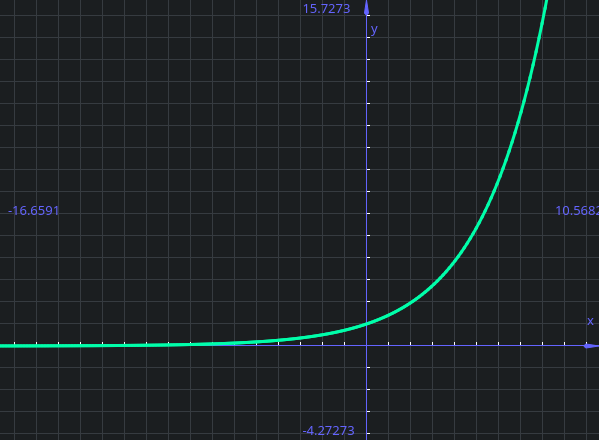{ loading=lazy } | 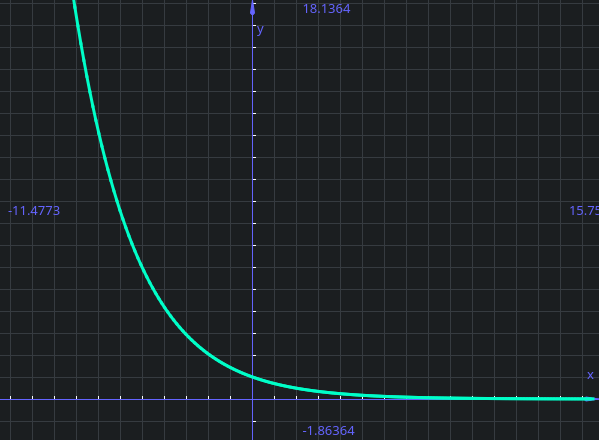{ loading=lazy } |
| Strettamente crescente                                       | Strettamente decrescente                                      |

In entrambi i casi la funzione intercetta il punto 1 delle ordinate e sono **sempre** positive:  

$$
a^x > 0 \forall x \in \mathbb R
$$

Entrambi le funzioni sono invertibili, poiché stettamente crescenti o decrescenti, quindi monotone, quindi iniettive e surgettive.  

### Logaritmo in base a

con $a \in \mathbb R, a >0, a \ne 1$ la funzione logaritmica è $f(x) = log_a(x)$

|                          a > 1                               |                         0 < a < 1                             |
|:------------------------------------------------------------:|:-------------------------------------------------------------:|
|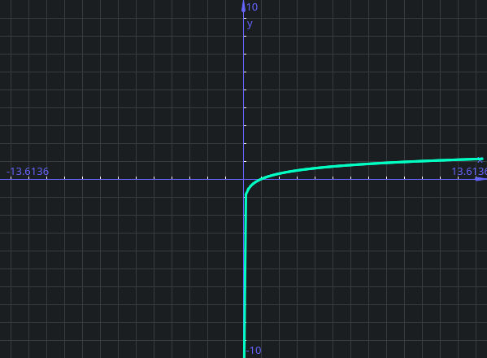{ loading=lazy } | 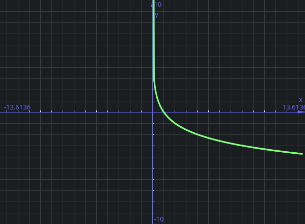{ loading=lazy } |
| Strettamente crescente                                       | Strettamente decrescente                                      |

Intercetta l'ascissa sempre ad 1 e presenta una simmetria (è specchiata) rispetto alla bisettrice (y=x) del grafico dell'esponenziale

### Funzione esponenziale (in base e)
Funzione esponenziale con $a = e \cong 2,71$  
è invertibile e la sua inversa si chiama logaritmo naturale.  
(Se la base non è specificata, in matematica si intende in base e).  

#### Cambio di base del logaritmo
Possiamo facilmente effettuare un cambio della base del logaritmo facendo uso di alcune regole matematiche:  

Il logaritmo è la potenza che dobbiamo assegnare ad a per ottenere x:  
$log_a (x) = y \Leftrightarrow a^y = x$  

Il logaritmo naturale dell'equazione dell'identità è:  
$log(a^y) = log(x) \Leftrightarrow y \cdot log(a) = log(x)$, ed abbiamo già visto y:  
  
$y = log_a (x)$  
  
Quindi possiamo sostituire y, per poi semplificarla:  
$log_a (x) \cdot log (a) = log(x) \Rightarrow log_a (x) = \frac{log(x)}{log(a)}$

## Funzioni trigonometriche
### Seno
Il seno è una funzione trigonometrica periodica di periodo $2 \pi$  
$f(x)=sin \ x \qquad f: \mathbb R \rightarrow [-1, 1]$  perché  $-1 \le sin(x) \le 1$.  
La funzione è surgettiba se per codominio prendiamo $[-1, 1]$  
Essendo periodica, $sin(x+2 \pi) = sin(x) \quad \forall x \in \mathbb R$.  
Essendo il seno sull'asse delle orinate, il cerchio con angolo 0 ha valore 0 sulle ordinate, quindi $sin(0) = 0$.  
La funzione è invertibile modificando dominio e codominio (quando la funzione è definita come $f: [ -\frac \pi 2 , \frac \pi 2 ] \rightarrow [-1, 1]$. f risulta quindi strettamente crescente (quindi monotona, quindi essendo continua, iniettiva) e surgettiva.)  
Dispari  
### Arcoseno
Funzione inversa del seno, definita come $f: [-1, 1] \rightarrow [ -\frac \pi 2 , \frac \pi 2 ]$  
La funzione arcsin è quindi l'inversa del seno quando il dominio è $[ -\frac \pi 2 , \frac \pi 2 ]$ ed il codominio è $[-1, 1]$  
Se così non fosse la funzione seno non è né iniettiva né surgettiva, e quindi non è invertibile.  

### Coseno
Il coseno è una funzione trigonometrica periodica di periodo $2 \pi$  
La funzione è il seno, ma traslata di $\frac \pi 2$ (quindi $cos(0) = 1$ )  
Pari  
### Arcocoseno
Se vogliamo invertire dobbiamo scegliere un intervallo dove la funzione è monotona.  
Possiamo quindi definire il dominio naturle come $cos(x): [0, \pi] \rightarrow [-1, 1]$.  

### Tangente
$tg (x) = \frac {sin(x)} {cos(x)}$, che quindi non è definita se $cos(x) = 0$.  
Il dominio è quindi $\{ x \in \mathbb R: x \ne \frac \pi 2 + k \cdot \pi, k \in \mathbb Z \}$, composto da infiniti intervalli disgiunti.  
È periodica di periodo $\pi$  
È invertibile quando $f: (-\frac \pi 2 , \frac \pi 2 ) \rightarrow \mathbb R$
È inoltre dispari  

### Arcotangente
È l'inversa della tangente  
$arctan: \mathbb \rightarrow (-\frac \pi 2 , \frac \pi 2 )$  
Strettamente crescente nel suo dominio.  
(Da non invertire con la cotangente)