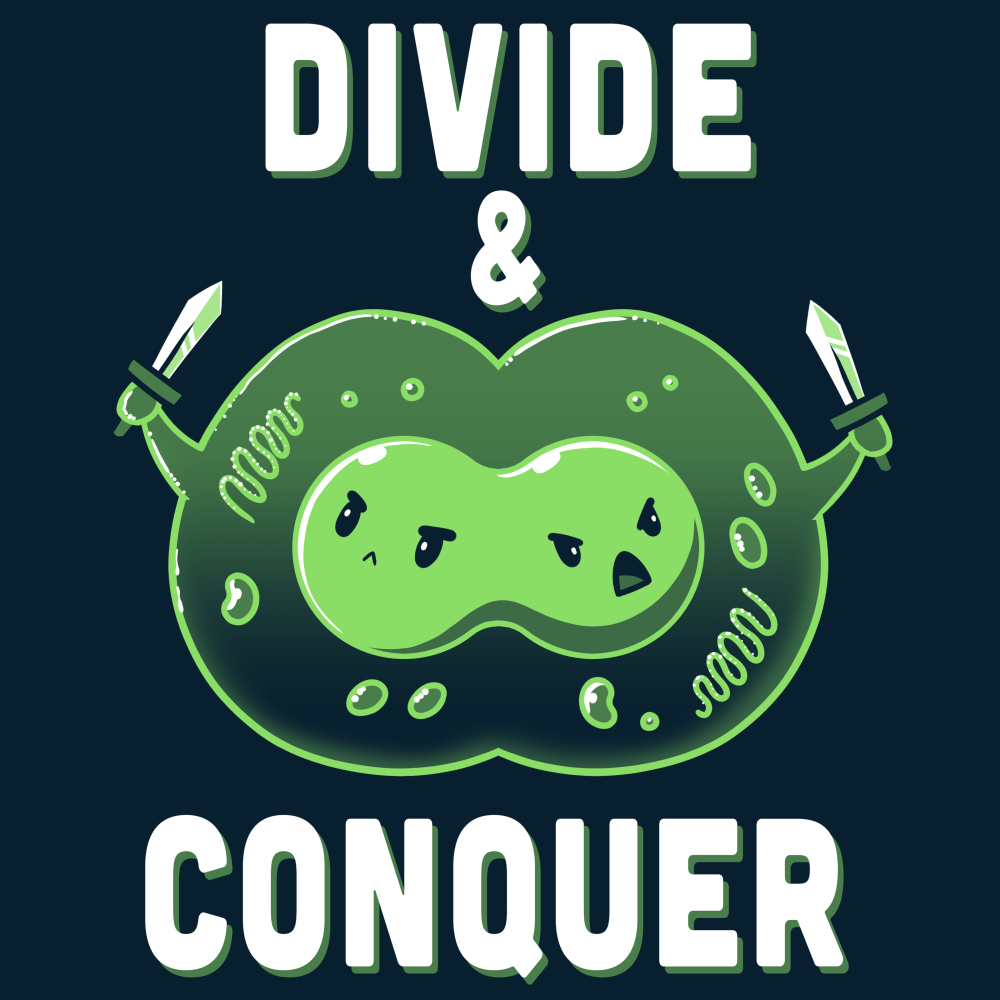

Quando scriviamo gli algoritmi in pseudocodice, lo facciamo per garantire una maggiore espressività e conicisione. Se necessario possiamo anche scrivere in linguaggio naturale.  
Di conseguenza, uno pseudocodice non si preoccupa di indirizzare problemi tipici dell'ingegnerizzazione del codice, ma solo di esprimere un algoritmo e quindi garantirne o renderne esplicita la correttezza.  
Dato che la performance della risoluzione di un certo problema dipende in equal modo sia dall'hardware di un calcolatore che dall'algoritmo, dovremmo considerare gli algoritmi come tecnologia. Cosa che già facciamo per l'hardware.  

### Loop invariants
Quando abbiamo un ciclo in una algoritmo, possiamo parlare di alcune proprietà che il ciclo deve soddisfare per aiutarci capire come mai un algoritmo è corretto.  
Queste proprietà sono dette invarianti di ciclo (loop invariants)e ci richiedono di dimostrare tre cose:

- Inizializzazione: Mostriamo che una certa proprietà è vera prima di effettuare la prima iterazione del ciclo
- Manutenzione: Una certa proprietà è vera prima di un'iterazione e rimane vera prima dell'iterazione successiva
- Terminazione: La proprietà ottenuta alla fine del ciclo, che ci permette di dimostrare che un algoritmo è corretto

È possibile tracciare un parallelismo con l'[induzione matematica](../../FdI/induzione.md), dove per provare una certa proprietà, possiamo provare un caso base ed un passo induttivo.  

## Analisi di un algoritmo
Analizzare un algoritmo è diventato sinonimo di predirre le risorse che l'algoritmo richiederà.  
Alcune tra queste risorse possono essere memoria, larghezza di banda o risorse fisiche, ma la più calcolata e di maggiore interesse è il tempo computazionale.  
Grazie ad un'analsi, siamo in grado di confrontare delle soluzioni tra di loro, scegliendo la più efficiente tra le due.  

### Modello di implementazione
Prima di analizzare un algoritmo, dobbiamo avere un modello della tecnologia che andremo ad usare, includendo le tecnologie a disposizione ed il costo per l'accesso.  
Durante l'uso del libro, si farà uso del modello RAM (Random-Access Machine), dove ogni istruzione è eseguita ona dopo l'altra senza operazioni concorrenti.  
È tuttavia necessario non abusare del sistema preso come riferimento: da un punto di vista formale sarebbe necessario definire ogni istruzione del modello ed il rispettivo costo, ma un tipo di analisi simile andrebbe ben oltre il dominio dell'analisi degli algoritmi.  
Un abuso potrebbe corrispondere a fare uso di un'istruzione in grado di ordinare un array in tempo costante. Un modello simile non risulterebbe realistico dato che i computer non hanno questo genere di istruzione.  

Possiamo limitarci quindi a dire che il modello RAM contiene istruzioni comunemente trovate nei computer reali (come aritmetica base (addizione, sottrazione, divisione, moltiplicazione, modulo, arrotondamento e troncamento), gestione dei dati (caricamento, salvataggio e copia), controllo (salti condizionati e non, chiamate a sottoprogrammi e return)).  
I computer reali tuttavia hanno anche loro zone "grigie", ad esempio un computer può calcolare un numero $2^k$ in tempo costante, effettuando un'operazione di shifting verso sinistra. I computer fanno inoltre uso di cache e memoria virtuale; Anche queste tecnologie non vengono incluse.

### La funzione di costo
In genere, il tempo richiesto da un algoritmo per calcolare una risposta dipende dalla grandezza dei parametri in ingresso.  
È quindi pratica comune descrivere il tempo di esecuzione di un programma in funzione della grandezza dei parametri dati in ingresso.  
La nozione di "grandezza" dell'input dipende dal tipo di problema preso in considerazione: per molti problemi, il modo più naturale di misurare l'input è il numero di oggetti dati in inputer, mentre per altri problemi può essere il numero totale di bit richiesti per rappresentare l'input.  

Un'altra assunzione importante è che ogni istruzione in ogni riga ($n$) di un programma impiega un tempo costante ($c_n$) per essere eseguita.  
Il tempo di esecuzione di un algoritmo è quindi la somma dei tempi di esecuzioni di ogni istruzione eseguita.  

### Analisi del caso medio e peggiore
Durante l'analisi di un algoritmo, ci si tende a concentrare sull'analsi del caso peggiore, che fornisce il _limite superiore_ (il massimo tempo che l'algoritmo può impiegare) per ogni input. Ci viene quindi garantito che l'algoritmo non impiegherà mai, più tempo del limite superiore, senza doverci far compiere stime.  
Per alcuni algoritmi il caso peggiore si verifica quasi sempre (ad esempio nel caso di una ricerca).  
Il tempo medio invece è spesso pessimo quanto il caso peggiore; Inoltre definire il caso medio è cimplicato in quanto ricihede tecniche di analisi probabilistica. Potrebbe inoltre non sempre essere ovvio cosa costituisce un caso medio per un dato problema. Potrebbe essere possibile fare delle assunzioni, come che tutte le possibili grandezze siano equamente probabili, ma spesso questa assunzione è violata.  

### Ordine di grandezza
Quando si analizza un algoritmo, si tende a considerare ogni istruzione dello stesso tipo come costante, ma spesso questo approccio ci fornisce più dettagli di quanti veramente richiesti. Un'astrazione di livello ancora più alto può essere quella basata sul _tasso di crescita_ o _ordine di grandezza_: 
Questo ci permette di considerare solo il termine di grado maggiore in un'equazione (ad esempio solo il termine $an^2$ nell'equazione $an^2+bn+c$). Questa considerazione viene dal fatto che per valori molto grandi, i valori di grado inferiore sono spesso insignificanti.  
Diciamo quindi che un algoritmo ha un caso peggiore di $\theta (n^2)$ (_theta_ di n al quadrato).  

Consideriamo quindi un algoritmo più efficiente di un altro quando questo ha un ordine di grandezza del caso peggiore inferiore.

## Design di un algoritmo

### Dividi et impera
Molti algoritmi utili sono recurisvi in natura: per risolvere un problema, chiamano sé stessi più volte in maniera recursiva, in modo da avere a che fare con problemi strettamente correlati.  
Tipicamente questi algoritmi seguono un approccio dividi et impera (o divide-and-conquer):  
Dividono un problema in sottoproblemi simili al problema originale ma più piccoli in grandezza

L'approccio dividi et impera è composto da 3 fasi:  

- Divide: Divide il problema in un numero di sottoproblemi più piccoli
- Conquer: '_Conquista_' il sottoproblema, risolvendolo risorsivamente. Quando la grandezza del sottoproblema diventa abbastanza piccola, risolve banalmente il sottoproblema
- Combine: Combina le soluzioni di 2 sottoproblemi in una soluzione per il problema originale.

!!! example "Merging with the merge sort"
    L'algoritmo merge sort è un algoritmo recursivo che serve per ordinare dei numeri.  
    L'operazione chiave dell'algoritmo è l'unione (passo combine) di due sequenze ordinate in una unica.  
    Nel caso del merge sort, effettuiamo l'unione (il merge) chiamando la procedura `Merge(A,p,q,r)`, dove A è l'array di elementi che vogliamo ordinare, e `p`, `q` ed `r` sono indici che puntano all'array e tali che $p \leq q < r$.  
    Questi sono i tre step che l'algoritmo compie (per un array con numero pari di elementi, per semplicità di spiegazione):
    
    1. Dividi: L'array è diviso a metà e la funzione è chiamata recursivamente. Al termine della chiamata si avranno 2 metà dell'array che corrisponderanno a 2 elementi  
    2. Conquista: Questo passo ordina i due elementi (quindi si tratta di comparare due numeri e determinare quale sia il più grande) e ritorna la sequenza ordinata
    3. Combina: In quest'ultimo passo, che parte dalla penultima iterazione, l'algoritmo si trova due array da 2 elementi ogniuno ordinato e deve unirli in un solo array. Per farlo inizia comparando i due elementi dei due array, con un indice per array. L'elemento più piccolo verrà quindi messo in un nuovo array ed il puntatore corrispettivo avanzerà fino a giungere alla fine dell'array. In questo modo si otterrà quindi un array ordinato composto dagli array più piccoli. Il risultato sarà quindi calcolato iterativamente fino a giungere al primo chiamante della funzione di sort, che si troverà quindi un array ordinato in tempo $\Theta(n)$. 
    
    (Rivedere; Sono andato praticamente solo a memoria)

#### Analisi di un algoritmo divide-and-conquer
Quando un algoritmo contiene una chiamata recursiva a sé stesso, possiamo spesso descrivere il suo tempo di eseguzione con un'equazione di ricorrenza.  
Possiamo quindi usare strumenti matematici per risolvere la ricorrenzae fornire dei limiti alle performances dell'algoritmo.  
L'analisi di un algoritmo segue i tre step base del divide and conquer:  
Partiamo definendo come $T(n)$ il costo del problema in funzione di un input di grandezza n.  
Se la grandezza del problema è sufficientemente piccola (ovvero $n < c$ per qualche costante $c$, si pensi all'ultima iterazione della fase di _dividi_), la soluzione richede un tempo costante, che scriviamo come $\Theta(1)$.  
Se invece la soluzione del problema richiede $a$ sottoproblemi, ogniuno di grandezza $\frac{1}{b}$ rispetto al problema originale, allora il sottoproblema richiederà un tempo di $T(\frac{1}{b})$ per essere risolto. Di conseguenza il tempo per risolvere $a$ sottoproblemi sarà $a\cdot T(\frac{1}{b})$.  

#### Big O
#### Floor ceiling & modul 

$a mod n = a - n \lower{a/n}$
$a \le a mod n < n$  
$(a mod n) = (b mod n)$, then $a \eqiv b (mod n)$ (a is equibalente to be modulo n). $a \nequiv b$ if that's not the case  
$ln^* n$  
