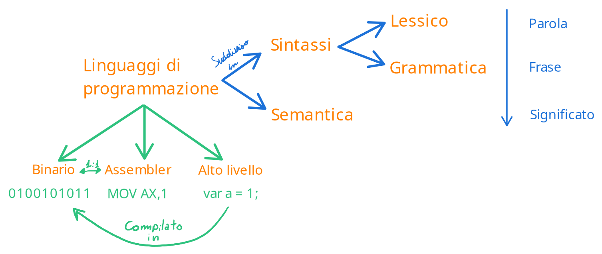
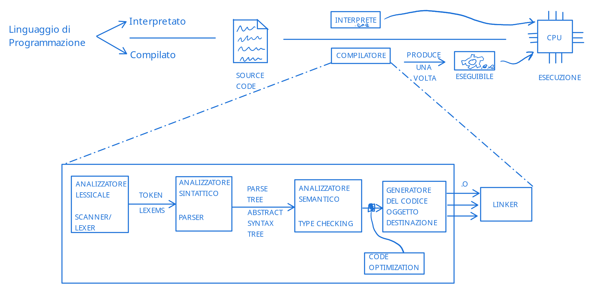
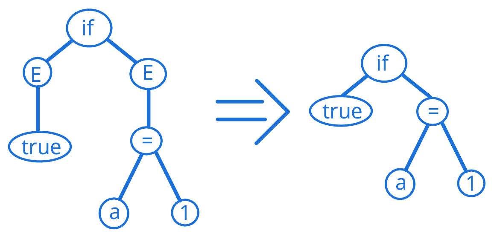
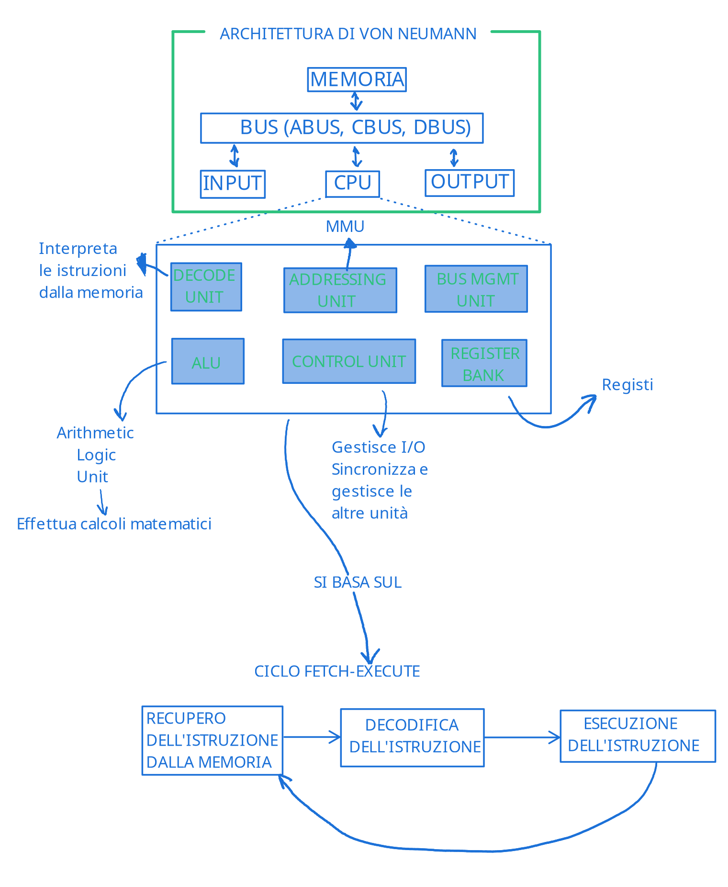

## Definizione di Algoritmo

Questo corso tratta principalmente di algoritmi, quindi è bene iniziare con una definizione formale di Algoritmo:  

!!! definition "Definizione di Algoritmo"
    Un algoritmo è una **descrizione formale** di una **sequenza finita** di azioni** elementari** e **non ambigue**, che prendono dei dati in input, vengono eseguite e producono dei dati in output.  
    Gli algoritmi **risolvono una classe di problemi**.

I dati in input determinano un'istanza della classe di problemi che si andrà a risolvere.  

Basandoci su questa definizione, possiamo ora definire cosa significa programmare:  

!!! definition "Programmare"
    Programmare è l'atto di scrivere un documento che risolve un problema reale e che può essere compreso ed eseguito da un computer.  
    Idealmente il documento deve essere scritto usando la soluzione più efficiente possibile.  

E quindi ora possiamo dire cos'è un programma:  

## Definizione di Programma

!!! definition "Definizione di Programma"
    Scrittura di un algoritmo in un linguaggio di programmazione

Il linguaggio di programmazione è quindi il linguaggio in cui si codifica l'algorimo per renderlo poi interpretabile dal computer.  

Un linguaggio è composto in 2 parti: **sintassi** e **sematica**.  
I due temi sono importantissimi e verranno trattati con maggiore dettaglio nella pagine successive.  
Brevemente, possiamo pensare alla sintassi come l'equivalente della correttezza grammaticale in un linguaggio naturale (come l'italiano).  
La semantica indica invece quali operazioni sono legali in un linguaggio: ad esempio non dovrbbe essere possibile associare ad un numero intero il valore "stringa" (che è una _parola_ e non un _numero_).  


Il linguaggio si divide poi in due categorie: esistono linguaggi statici e linguaggi dinamici.  
A seconda del tipo, esistono diversi pasaggi a cui il codice sorgente deve essere soggetto prima di poter essere compreso da un computer.  
I passaggi sono spesso composti da una semplificazione relativamente semplice (almeno in termini di concetto), che semplifica o tratta il codice "abbassando" il suo livello di complessità.  



Ad esempio in un linguaggio statico, abbiamo diversi passaggi:  

- **Analizzatore lessicale/lexer/scanner**  
    Questo primo passaggio serve a scomporre il linguaggio in _token_ o _lexems_.  
    Quindi ad esempio il seguente codice:  

    ```javascript
    if (true){
        a = 1;
    }
    ```

    Verranno individuati i token `if`, `(`, `true`, `)`, `{` `a`, `=`, `1`, `;`, `}`  
    Questo insieme di token viene poi passato all'analizzatore sintattico

- **Analizzatore sintattico/parser**  
    L'analizzatore sintattico si occupa di assicurarsi che ogni token sia grammaticamente corretto (ad esempio `if` è corretto, mentre `fi` no)  
    Si occupa inoltre di assicurarsi che la "frase" abbia senso da un punto di vista grammaticale.  
    L'esempio appena visto è corretto, mentre uno snippet di codice come il seguente non lo è: 
    ```javascript
    if if (true {
    ```
    Se tutto è corretto, l'analizzatore sintatico restituirà un **albero di sintassi astratto**, che rappresenterà la "frase" del linguaggio struttato  
    Continuando con l'esempio precedente, quello che segue è l'equivalente dell'albero di sintassi astratto (E sta per espressione):  
    

- **Analizzatore semantico/type checker**  
    L'analizzatore sematico si occupa di simulare l'esecuzione del programma per assicurarsi che non si presentino molteplici errori, come:  

    - Trovare nomi non dichiarati o dichiarazioni di nomi già dichiarati
    - Uso di operatori con tipi non compatibili (come ad esempio la somma tra "a" e 2), ed assicurarsi che l'uso dei tipi sia usato con coerenza
    - Funzioni chamate con numero e/o tipo sbagliato di argomenti o che ritornano un tipo non adatto
    
    Ed altre funzioni poi in base al linguaggio (come variabili non inizializzate o non usate, use after free e use before assignment, blocchi di codice non raggiungibili, funzioni mai invocate o senza effetti)

    Se è tutto ok, quello che viene restituito è quello che viene detto three-address code, un linguaggio intermediario che usa fino a tre indirizzi per rappresentare ogni istruzione.
    
- **Eventuale passaggio di ottimizzazione del codice**  
    Esiste un eventuale passaggio di ottimizzazione che alcuni toolchain possono effettuare per migliorare le performances, restituendo una versione più efficiente (sempre in three-address code)

- **Generatore del codice oggetto**  
    Il generatore del codice oggetto si occupa di prendere three-address code ed avviare un primo stato di compilazione in codice oggetto (molto simile a codice macchina).  
    Questo codice non è ancora eseguibile, e non è neppure necessariamente un singolo file.
    
- **Linker**  
    Il linker è l'ultimo passaaggio della compilazione, e si occupa di prendere il risultato del generatore del codice oggetto (codice oggetto) e "collegarlo" con le librerie di cui il programma fa uso (ed inserire un loader).  
    Il risultato del linker sarà quindi un programma esegubile dal computer.  

??? tip "Pannello storico"
    Nel '50 Hopper ha scritto il primo compilatore sperimentale  
    Nel '57 Backus ha scritto il primo compilatore  


## Architettura di von-Neumann

Un programma viene eseguito in un computer, quindi ha senso parlare di cosa intendiamo per computer, per poter avere una buona astrazione sulla quale basarci poi.  
L'astrazione più conosciuta di computer, è il modello di Von Neumann ed è composto da un bus (un canale di comunicazione), che connette memoria, processore, input ed output.  



### Ciclo fetch-execute
Il ciclo fetch-execute è un paradigma su cui i processori si basano, ed è composto da un ciclo in cui il processore prende costantemente delle istruzioni da eseguire dalla memoria principale, le decodifica e le esegue, per poi ripetere il ciclo nuovamente.  
