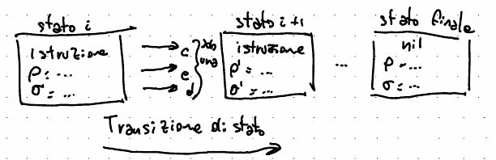

# Semantica
La semantica è lo studio del significato dei programmi ed è formalizzato nei termini delle azioni che il modello deve compiere.  

La semantica è una funzione che permette di associare (attraverso un'_interpretazione semantica_) ad un programma (dato il suo dominio sintattico) un corrispondente significato, dato dall'interpretazione (dominio semantico).  

Ne esistono di due tipi:
- Denotazionale  
    Simile ai linguaggi funzionali, descrive i programmi sulla base dei passi che la macchina astratta deve compiere.  
- Operazionale  
    Permette di descrivere i programmi sulla base di istruzioni atomiche che modificano lo stato della macchina astratta (inteso come codice sorgente, dati dell'elaborazione e memoria): se durante la processazione del codice non è possibile trovare una regola che permetta il cambio di stato, c'è un errore nel programma.  

Si divide in  

- Statica (denotazionale)  
    La semantica statica non coinvolge l'esecuzione e riguarda proprietà che possono essere dedotte dalla rappresentazione del programma  
    Nella pratica, effettua un controllo sui tipi e se questi vengono usati coerentemente nel resto del programma (associa ad ogni identificatore (variabile) un tipo)  
- Dinamica (operazionale)  
    La semantica dinamica si occupa di **simulare** l'esecuzione del programma: come agisce un'istruzione in memoria in una macchina astratta

Si occupa quindi di mappare un'identificatore ed il suo valore su T:  

$$
\underbrace{\text{ambiente statico } \Delta}_{\text{funzione}}: \underbrace{id}_{identificatore} \cup Val \to \underbrace{T}_{\text{tipo  }} \cup T_{\text{loc}}
$$

## Tipi di comandi

<!-- Capire cosa significhi il vdash; Dovrebbe essere l'applicazione della regola, tipo un \to -->

### Comando
Un comando non ha effetti sull'ambiente (che a questo punto può essere pensato come alla memoria)  
Un comando ben formato ha la forma $C: \Delta \vdash_C C$

### Espressione
Un'espressione porta ad un valore, che ha quindi anche un tipo.  
Se un'espressione è ben formata, posso determinarne il tipo.  
Un'espressione ben formata ha la forma $E: \Delta \vdash_e E : \tau$ (dove tau ($\tau$) è il tipo) (e si legge "Un'espressione è ben formata se partendo da un certo ambiente statico alla mia espressione posso associare un tipo tau)  
Una volta associata la semantica statica delle espressioni, diventa possibile associare un tipo ad ogni espressione corretta, operando per induzione sulla struttura della grammatica.

### Dichiarazione
Una dichiarazione ha un'effetto sull'ambiente, in quanto quando si dichiara qualcosa, l'ambiente ($\Delta$) cresce  
Ha la forma $D: \Delta \vdash_D D : \Delta^I$  
Dove $\Delta$ è l'ambiente, D è la dichiarazione e $\Delta^I$ è il nuovo ambiente, esteso dopo la dichiarazione

## Semantica Statica
La semantica statica si occupa di verificare formalmente un programma dal punto di vista della sintassi e delle regole dei tipi utilizzati, considerando quindi le sue espressioni.  

Le regole della semantica statica sono codificate sotto forma di regole d'inferenza, in cui se una serie di **premesse** risulta essere soddisfatta, allora ciò **implica** una **conclusione**.  

Un'espressione si dice ben formata quando, partendo da un certo ambiente statico, all'espressione posso associare un tipo $\tau$ (letto tao)  
Un'espressione è inoltre composta da letterali (come costanti, identificatori, etc...), che a loro volta sono composti da operatori unari e binari (e simboli dell'alfabeto)  

Si basa su tre principi:  

- **Regole di inferenza** (scritte come $\frac{\text{premesse}}{\text{conclusione}}$)  
    Una regola di inferenza ci permette di dire che se è vera la premessa, allora è vera anche la conclusione:  
    $\frac{A_1,...,A_n}{B}$ equivale a $A_1 \land ... \land A_n \then B$  
    Se ogni premessa $A_i$ è vera, allora B è vera
- **Assioma** (regole di inferenza senza premessa, quindi sempre vere)  
    $\frac{\varnothing}{B} \equiv \frac{}{B} \equiv \varnothing \to \varnothing \So \bar B$
- **Dimostrazione**  
    Si effettua con un albero, in cui ogni componente è una parte della regola da dimostrare:  
    La radice è l'asserzione da dimostrare  
    Le foglie sono assiomi
    I nodi intermedi sono costruiti applicando le regole semantiche (regole di inferenza)

### Principio della composizionalità
Una definizione semantica deve poter essere composizionale: il suo significato deve essere fornito in termini di significato base dei suoi componenti elementari (finiti).  

- Componenti elementari  
    Produzioni della grammatica associate a regole semantiche
- Composizione  
    Composizione, che permette di arrivare alla sematica di tutte le espressioni possibili:  
    Il significato di un'espressione è una funzione del significato dei suoi componenti elementari

### Principio di oscuramento ed estensione
Oscuramento in semantica ed estensione

$$
\Delta \underbrace{[\Delta^I]}_{\text{Esteso}} (x) = \begin{cases}
\Delta^I(x) & \text{ se } \Delta^I(x) è definito \\
\Delta(x)   & \text{ altrimenti}
\end{cases}
$$

## Scoping
Lo scope è la porzione di un programma in cui l'identificatore può essere referenziato.  

Un identificatore si dice **legato** se esiste una dichiarazione a cui si "appoggia".  
Non è legato (**libero**) quando l'identificatore non è presente nell'ambiente $\Delta$.  
Un identificatore usato senza essere stato definito o al di fuori dello scope di dichiarazione si dice libero.  
Se esistono occorrenze di identificatori liberi, il programma non è corretto staticamente.  

Quando un identificatore è definito, si dice che è un **posizione di definizione** e costituisce quindi un'**occorrenza di legame** per le altre occorrenze nello scope.  

Quando l'identificatore viene usato all'interno dello scope di definizione, si dice legato dalla sua occorrenza di legame corrispondente.  

### Block scope

Il block scope delimita il campo d'azione dello scope basandosi su blocchi di codice.  
Una valora è visibile solo nella parte di blocco seguente a quella in cui è stata definita (ed eventuali blocchi annidati a quello corrente e successivi alla dichiarazione).  
La vita di una variabile inizia quindi quando viene dichiarata, e termina quando il blocco di definizione termina.  

#### Information hiding 
Un identificatore definito in un blocco annidato interno, nasconde/oscura la visibilità dell'identificatore con lo stesso nome ma definito nel blocco più esterno  

### Scoping Statico

Lo scoping statico ci permettere di vedere tutti gli identificatori a cui è possibile accedere nell'ambiente in un dato momento.  
È anche ciò che ci permette di avere information hiding.  

Lo scoping statico permette inoltre di vedere la vita dell'identificatore a tempo di compilazione attraverso l'albero sintattico e permette di decidere se un identificatore è legato e, nel caso, da quale occorrenza di legame dell'albero di sintassi  

È utile aggiungere inoltre che lo scoping statico si riferisce alla catena statica (si sta parlando dello stack di esecuzione/stack frame, ed è visibile come un array) dove rientrano i parametri formali  

A tempo di compilazione, le variabili libere del corpo vengono legate, costruendo delle chiusure.  

!!! definition "Chiusura"
    Una chiusura è un blocco che lega le variabili libere di una funzione, usando l'ambiente dinamico al momento della dichiarazione.  
    ha un formato di tipo `D;C`

Si creano quindi della lambda-astrazioni che registrano i parametri formali che verranno poi associati ad una chiamata di funzione.  

La dichiarazione della funzione genera nell'ambiente dinamico un legame tra l'identificatore della funzione e la sua $\lambda -astrazione$  

### Scoping Dinamico

Non è ricavabile a tempo di compilazione.  
Le variabili libere sono legate solo al momento di esecuzione.  
Questo significa che quando la funzione viene dichiarata, nella chiusura viene registrato solo il corpo della funzione. Non vengono legati i parametri.

## Principio del privilegio minimo
Ogni versione del programma deve avere i privilegi necessari per accedere alle risorse ed identificatori minimi necessari per svolgere il sui compito

## Type checking

Riceve un albero di sintassi le cui foglie sono le stringhe del linguaggio  
Funziona tra due insiemi, che associa significati e simboli  
Il dominio sintattico non è finito
Indicare i componenti elementari (`for`, `while`, `+`, `*`)  
Il significato di una qualunque frase viene fornito in componenti elementari  
Serve una caratterizzazione formale e finita del dominio semantico

## Semantica dinamica
La semantica dinamica si occupa di determinare gli step del programma quando questo viene eseguito.  
Si tratta quindi di un procedimento che **emula** l'esecuzione.  

La semantica dinamica si basa su funzioni che specificano i passi elementari:  

- Esecuzione dei comandi
- Valutazione delle espressioni
- Elaborazione delle dichiarazioni

<!-- L37 -->
In genera la parte della semantica dinamica è gestita dal Loader (che quindi si può vedere come una funzione $Loader: nome \to address$) <!-- verificare -->  
Come abbiamo detto precedentemente, un identificatore è una sequenza di caratteri (una stringa).  
In L, un identificatore contiene lettere, cifre e `_`. Inoltre non inizia con una cifra.  

Come con la semantica statica, abbiamo a che fare con un ambiente, che stavolta chiameremo $\rho$. In aggiunta avremo anche a che fare con una memoria, che esprimeremo come $\sigma$.  

$\rho$ Ambiente: una funzione che associa nomi mnemonici a locazioni di memoria.  
$\sigma$ Memoria: una funzione che associa locazioni a valori.  

Essendoci una memoria che viene modificata con il passare del tempo (e l'esecuzione del programma), ci sono delle transizioni di stato.  

Per esprimere questi avvenimenti, abbiamo due strumenti:  

### Transizioni di stato
Le transizione di stato sono rappresentati come blocchi ed includono molteplici regole di inferenza tra una transizione e l'altra, rendendo lo strumento di facile comprensione e visibilità sui processi, a scapito di una minore formalità.  

  

Come si vede dalla foto, ci possono essere 3 tipi di frecce, ognuna delle quali rappresenta il tipo di passaggio fatto (esecuzione, valutazione o dichiarazione)  
La freccia rappresenta una funzione di interpretazione sematica.
Nel caso si vogliano rappresentare più transizioni e quindi l'applicazioni di molteplici regole (ad esempio valutazioni), si può usare una freccia con una stellina: $\to^*_e$  

$\anglebr{E, \rho, \theta} \to_e \anglebr {E^{'}, \rho, \theta}, Eval(E,\rho,\theta) = v \in Val \Leftrightarrow \anglebr {E, \rho, \theta} \to^*_e v$

Le transizioni di stato fanno parte di un sistema di transizioni, una quadrupla $\anglebr{S,T,F,S_0}$:  

$$
\begin{cases}
S & stati & = \{ \anglebr{E, \rho, \theta} \cup V | v\ in Val_E \} \\
T & transizioni & \subseteq S \times S, T=\{ (S_1, S_2)|S_1, S_2 \in S \land S_1 \to S_2 \} \\
F & \text{stati finali} & \subseteq S, F=Val_E \\
S_0 & \text{stato iniziale} & \in S \text{(espressione da valutare)}
\end{cases}
$$

$\{ \anglebr{E, \rho, \theta} \cup V | V \in Val_E, \underbrace{\to_e}_{\text{regola di inferenza}}, \underbrace{Val_E}_{\text{valore finale}}, \underbrace{(Expr)}_{\text{espressione da valutare}} \}$

### Regole di inferenza

Le regole di inferenza sono molto simili a alle regole di inferenza di semantica statica, con l'aggiunta della memoria e l'ambiente invece che mappare su tipi, mappa su locazioni di memoria.  
