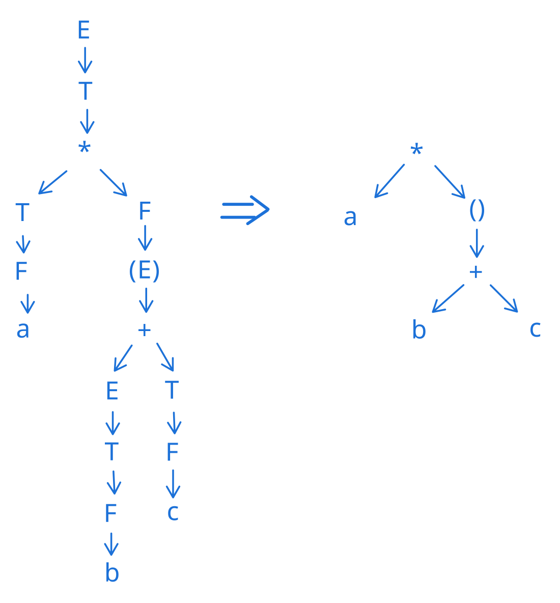

La sintassi si occupa di controllare se una stringa è legale (ovvero rispetta le regole della grammatica)

Ogni elemento (o carattere) del codice di un programma è un simbolo e fa parte della sintassi.  
La sematica (non la sintassi) si occupa di "dare" il significato ad ogni simbolo.  
La sintassi è quindi la _struttura_ dei costrutti di cui il linguaggio di programmazione farà uso.  

La sintassi si basa sul lessico, e ci permette quindi di effettuare due operazioni:

- Analisi Lessicografica (controllare che i termini siano validi)
- Grammatiche (tutte le frasi legali che posso esprimere nel linguaggio che sto definendo)  
    Ci permette quindi di:
    - **Definire** un linguaggio durante la fase di creazione
    - **Leggere e studiare** un nuovo linguaggio in fase di apprendimento

!!! definition "Definizione di Alfabeto"
    Insieme finito e non vuoto di simboli o caratteri

!!! definition "Definizione di lessico"
    Insieme delle parole del linguaggio composte a partire da un **insieme** di **simboli atomici** detti **caratteri** che rappresentano l'**alfabeto** del linguaggio.  
    Le parole saranno poi utilizzate per formare _frasi_ esprimibili in quel linguaggio

!!! definition "Definizione di parola legale"
    Le parole legali sono un sottoinsieme di tutte le parole che si possono costruire.  
    Una parola legale sarà quindi una parola appartenente a questo sottoinsieme 

!!! definition "Definizione di stringa"
    Una stringa è il risultato della concatenazione di elementi di un insieme (finito o vuoto) di simboli (un alfabeto)

!!! definition "Linguaggio di Programmazione"
    un linguaggio di programmazione è l'insieme delle stringhe ammissibili, che prendono il nome di programmi.  

ASCII è un alfabeto. La maggior parte dei linguaggi si basa su un sottoinsieme di questo alfabeto (insieme riferito come "printable characters" o caratteri stampabili, come quelli di cui è composta questa pagina)

## Operazioni sui caratteri

### Concatenazione
Operazione definita sui simboli di un alfabeto: $\forall a,b \in A . a \cdot b = b a$

### Esponenziale
Dato $x^0 = \epsilon$ (dove $\epsilon$ = stringa vuota), $x^n = x \cdot x^{n-1}$  

### Prefisso
Stringa con uno scarto della coda

### Suffisso
Stringa con uno scarto dalla testa

### Sottostringa
Stringa senza prefisso e suffisso (prefisso e suffisso risultano cancellati)

### Lunghezza di una stringa
Si indica con i trattini verticali (che richiamano alla cardinalità) ed indicano il numero di elementi dell'alfabeto nella stringa:  
$|ciao| = 4$

### Chiusura di Kleene *
Insieme di simboli contenente tutte le stringhe di tutte le lunghezze (0($\epsilon$),1,2,3,...) formabili concatenando un alfabeto

#### Chiusura positiva +
Una chiusura positiva è una chiusura di Kleene con lunghezza > 0  
Ci permette di identificare un insieme non vuoto di tutte le stringhe possibili ottenibili concatenando un alfabeto.  

## Linguaggi

### Linguaggio infinito
Definibile attraverso 3 metodi ed è definibile enumerando tutti i suoi elementi (ove non infiniti)  

    Un linguaggio L su un alfabeto A è un sottoinsieme della chiusura di Kleene (considerando insiemi non vuoti e non banali)
    Un linguaggio di programmazione classico può essere pensato come un sottoinsieme di ASCII*

#### Generativo
Insieme delle stringhe generate (che seguono le regole) da una grammatica

#### Riconoscitivo
Insieme delle stringhe riconosciute ad un automa

#### Algebrico
Insieme delle stringhe soluzione di un sistema di equazioni algebriche

## Albero di derivazione

L'albero di derivazione è un albero radicato non vuoto in cui:  

- La radice è etichettata con il simbolo iniziale
- Ogni nodo interno è etichettato con un simbolo non terminale e rappresenta l'applicazione di una produzione
- Ogni foglia è etichettata con un simbolo terminale

La stringa corrispondente ad un albero (di derivazione) si ottiene dalla frontiera, concatenando le etichette delle foglie da sinistra a destra

Ogni sotto albero risulta essere l'applicazione di una produzione  
Ad ogni albero sono associate più derivazioni, a seconda dell'ordine in cui vengono applicate le derivazioni.  

Esiste una corrispondenza biunivoca tra alberi di derivazione e derivazioni canoniche: se derivo sempre da destra (o sinistra), ottengo sempre lo stesso albero.  
Ciò significa che se derivo sempre da destra (o sinistra) ottengo sempre lo stesso albero.  

### Grammatica ambigua
Lo stesso linguaggio si può ottenere con 2 alberi diversi (ovvero, ci può essere indecisione su quale può essere l'albero da usare). 
La produzione non riesce a determinare una precedenza con gli operatori (questo perché dal punto di vista della sintassi tutti i simboli hanno uguale precedenza, non abbiamo ancora inserito una semantica che ci permette di attribuire un significato degli operatori (come addizione e moltiplicazione) e quindi una precedenza).  
Ciò porta il parser a decidere arbitrariamente l'ordine degli operatori, prima di passare all'organizzatore semantico (che poi è in grado di assegnare un significato ai simboli)  

La soluzione a questo problema (**disambiguazione**) è data dall'aggiunta di operatori per non permettere alla scelta di poter esistere in primo luogo.  
Questo perché l'analizzatore sintattico (parser) usa grammatiche non ambigue per determinare la precedenza tra operatori. Se così non fosse, potrebbero verificarsi "undefined behavior"  

### Albero di sintassi astratta
Un albero di sintassi risulta essere una versione compatta dell'albero di derivazione, perché imporre la precedenza aumenta il numero di produzioni.  
Per ottimizzare quindi si mantiene la non ambiguità, rimuovendo però tutti i nodi interni non terminali che non sono direttamente collegati a foglie.

??? example "Esempio di albero di sintassi"
    prendendo come regole scritte in BNF le seguenti produzioni:  
    $E ::= E + T | T$  
    $T ::= T \star F | F$  
    $F ::= a | b | c | (E)$  

    Possiamo prendere la stringa $a \star (b + c)$ ed effettuare una trasformazione delle produzioni partendo da E come simbolo iniziale:  
    $E \to T \to T \star F \to T \star (E) \to T \star (E+T) \to T \star (E+F) \to T \star (E+c) \to$  
    $\to T \star (T+c) \to T \star (F+c) \to T \star (b+c) \to F \star (b+c) \to a \star (b+c)$  

    { loading=lazy }  

    In questo esempio la frontiera sono i nodi `a`, `*`, `b`, `+`, `c`

---

##### Categorie sintattiche 
###### Dichiarazioni
###### Comandi 
###### Espressioni

##### Lessico
##### Grammatica