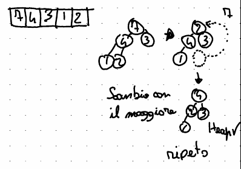

# Le strutture dati
Le strutture dati sono costrutti usati per organizzare dati o valori da manipolare.  
L'organizzazione dei dati è divisa in due: 

- Struttura fisica  
    La struttura fisica dei dati si occupa di rappresentare il modo in cui i dati sono fisicamente immagazzinati all'interno della memoria centrale del computer.  
    Un esempio può essere un array, che rappresenta 
- Organizzazione logica  
    Come i dati sono organizzati in maniera logica, ad esempio un grafo.  

Una struttura dati (ADS, Abstract Data Type) permette di legare la struttura fisica di un computer con un'organizzazione logica  

Le operazioni che un'ADS deve essere in grado di fare sono:  

- Lettura
- Scrittura/modifica
- Eliminazione/aggiunta

Alcune strutture di dati possono essere:  

- Array
- Stack (pila)
- Coda
- Lista collegata
- Alberi e grafi

## Array
Un array ha un'organizzazione logica che corrisponde a quella fisica: i valori sono in posizioni logicamente contigue e (spesso) in indirizzi contigui di memoria (a seconda del linguaggio e della sua implementazione [^1]).  
[^1]: Looking at you, [javascript](https://it.javascript.info/array#internamente)  

Permette quindi un accesso diretto ai valori, che permette di avere operazioni di accesso e modifica facili e veloci.  
Rende tuttavia complicate le operazioni di cancellazione ed inserimento, che dipendono poi dall'implementazioni

Si può quindi riassumere come una collezione ordinata in cui esiste un ordine posizionale 

## Stack (pila)
Logicamente i valori sono posizionati in celle logicamente contigue, in una struttura LIFO (Last In First Out), permettendo 3 metodi:  

- Push (aggiunta di un elemento nella pila)
- Pop (rimozione di un elemento dalla pila ed ispezione del suo valore)
- Top (ispezione del prossimo valore senza rimuoverlo dalla struttura)

## Code
Anche nelle code gli elementi sono logicamente contigui, mentre la struttura in questo caso è FIFO (First In First Out).  

Permette operazioni di enqueue (messa in coda) e dequeue (rimozione dalla coda)

## Lista collegata
La lista è una struttura in cui gli elementi non sono contigui, quindi è richiesto un modo per accedere al successivo (ed in caso al precedente).  

Lettura, inserimento, modifica e cancellazioni sono quasi banali e possono essere resi circolari (struttura ad anello. )


## Grafi
<!-- L55 -->
Un grafo è una struttura dati visibile come una coppia di nodi ed archi.  

### Algoritmi di ricerca
In un grafo, per effettuare una ricerca, esistono numerose soluzioni.  
Lo scopo può voler essere quello di mappare il grafo o cercare un nodo con un valore specifico.  

#### BFS 
L'algoritmo di Breadth First Search si occupa di ricercare prima i figli

#### DFS
La DFS (Depth First Search) esamina ogni figlio in profondità ed in maniera ricorsiva, per poi procedere con gli altri.  

Nel farlo, permette di costruire un "albero" (ovvero un DAG) ed eventuali archi che creano più path per giungere ad un nodo.  
Questi archi sono:  

- Tree  
    Un arco di tipo tree è visto come un "normale" nodo dell'albero.
- Back
    Un Back edge è un arco che permette di arrivare ad un antenato del nodo, rispetto agli archi di tipo tree
- Forward
    Un Forward edge è un arco che permette di arrivare ad un discendente attraversando meno archi rispetto a quanto si farebbe utilizzando un tree edge
- Cross
    Un Cross edge è un arco che permette di attraversare l'albero per arrivare ad un fratello o ai suoi antenati/discendenti

##### Topological sort (DAG) DFS
Il topological sort è un algoritmo basato su DFS che permette di stabilire un ordine delle dipendenze (ed è infatti usato anche da software come package managers).  
Permette di fare un'ordinamento secondo la tipologia, seguendo l'ordine di scoperta dei nodi fatto dalla DFS

<!-- minchia se è spiegato di merda -->

### Albero
<!-- L27-->

Un albero è una struttura dati che si può immaginare come un albero al contrario: in alto abbiamo la radice e sotto troviamo i figli  
  

Ogni nodo (o pallino) può far parte o meno di un albero

foresta
Relazione gerarchica (padre, figlio, fratello, progenitore)
foglie
proprietà strutturali

#### Albero binario
<!--L44-->
Un albero binario è una struttura definita su un insieme di nodi
Può non contenere alcun nodo (albero vuoto), può contenere un solo nodo detto radice, e può contenere un sotto albero sinistro o destro della radice.  
  

In memoria è rappresentato con nodo padre, il payload (quindi ad esempio chiave e valore), e puntatori al sotto albero sinistro e destro.  

  

Può essere visitato in 3 diversi modi:

- Visita anticipata  
    Prima viene visitato il nodo, e poi i suoi sotto alberi
- Visita simmetrica  
    Prima viene visitato il figlio sinistro, a seguire il nodo, ed infine il figlio desto
- Visita posticipata  
    Prima viene visitato il figlio sinistro, poi il figlio destro e solo infine il nodo

Per quanto riguarda le proprietà strutturali, possiamo facilmente individuare questi:  

- Al più $2^l$ nodi al livello l
- Profondità la più di $2^{d+1}-1$ nodi
- Un albero con n nodi ha profondità _almeno_ $\log_2(n+1)-1$

Ci sono diversi tipi di forme che possono assumere:  
<!-- L45 -->

- Completo  
    Tutte le foglie sono allo stesso livello e tutti i nodi interni hanno grado 2
- Completamente bilanciato:  
    È un albero completo con tutte le foglie alla stessa profondità
- Bilanciato  
    È un albero di dimensione n ed altezza h, se $h=O(log(n))$
- Completo a sinistra/Quasi completo  
    È un albero completo tranne per l'ultimo, dove le foglie vanno da sinistra a destra.  
    La prima non-foglia in un array si trova a $\lower {\frac n 2}$
- 1-bilanciato (bilanciato in altezza):  
    L'altezza dei sotto-alberi destro e sinistro differiscono al più di un'unità


Il costo di una ricerca è O(h) (in quanto per farlo tracciamo un percorso dalla radice alla nodo scendendo esclusivamente a sinistra o destra).  
Attenzione sul fatto che non essendoci un vincolo che mantiene l'albero bilanciato, h può diventare lineare.  

$\forall \text{nodo x nell'albero T}$  
  $\forall \text{nodo y nel sottoalbero sinistro}$  
    $y.key < x.key$  
  $\forall \text{nodo z nel sottoalbero destro}$  
    $z.key > x.key$  

L'operazione di ricerca $T(n) = O(h)$, dove $h=O(log(n))$ al caso medio/ottimo e $h=(O(n))$ al caso pessimo.  

Anche le operazioni per trovare il valore minimo e massimo hanno tempo O(h):  

- Minimo: Si ricerca il nodo più profondo a sinistra senza figlio sinistro
- Massimo: Si ricerca il nodo più profondo a destra senza figlio destro

L'operazione successore (trovare il nodo y con la più piccola chiave maggiore di x) invece è un po' più complicato:  

- Se il nodo ha un sotto albero destro, si trova il minimo tra i nipoti destri
- Altrimenti, si trova l'antenato più vicino ad x, ovvero che contiene x nel suo sottoalbero sinistro

Anche questo ha come complessità $T(n)=O(h)$  

Notare che non ci serve comparare le chiavi, in quanto facciamo uso della proprietà strutturale  

##### Inserimento  

I nuovi nodi sono aggiunti come foglie. La complessità è quindi $T(n)=O(h)$  

##### Cancellazione  

- Se il nodo è una foglia, è sufficiente eliminare la foglia
- Se il nodo è interno ed ha un figlio, si collegano padre e figlio del nodo
- Se il nodo ha due figli, si sostituisce il successore (la foglia dx) con il nodo, e si elimina il nodo

#### 2-3 alberi
<!-- L46 -->

Un albero binario può essere complicato da mantenere bilanciato, e si può formare facilmente una catena, che fa deteriorare le prestazioni.  

Le proprietà strutturali di un 2-3 albero puntano a mantenere un albero bilanciato:  

- Ogni nodo ha almeno due figli e massimo tre
- Tutti i cammini radice-foglia hanno la stessa lunghezza (quindi $\log_2(n) \le n \le log_3(n)$)
- I dati sono tutti quanti memorizzati nelle foglie (in ordine crescente da sinistra verso destra)
- I noti intermedi contengono il massimo valore raggiungibile andando a sinistra (ed al centro nel caso il nodo abbia tre figli)

Si usano i 2-3 alberi in quanto hanno prestazioni superiori agli ABR, che risultano essere lineari su h

##### Ricerca
La ricerca ha un tempo di $\Theta(log(n))$, in quanto, grazie alle proprietà strutturali, tutti i percorsi radice-foglia hanno uguale lunghezza.  

##### Inserimento
L'inserimento di un nuovo valore si basa su alcuni step:  

1. Provo a cercare il valore nell'albero, per trovare la posizione più adatta
2. 
  - Se il nodo andrebbe in un nodo con due figli, si crea un nuovo figlio e si inserisce il valore del secondo figlio nel padre.
  - Se il nodo ha tre figli, si effettua l'operazione di **split**: Viene creato un nuovo nodo con i primi due figli e si aggiunge il valore al nodo appena trovato.  
  Se il genitore ha 4 figli si effettua una chiamata ricorsiva all'operazione di split

La complessità è $O(log(n))$  

##### Eliminazione

Si riceraca il valore da eliminare nell'albero. Una volta trovato, se rimane un solo figlio, si deve ricorrere all'operazione di **merge** (che è l'opposto dell'operazione di split), che consiste nell'unire due fratelli


#### Heap
<!-- Lxx -->

Albero binario quasi completo e in cui ogni nodo interno ha un valore maggiore uguale o minore uguale rispetto ai suoi due figli (in caso di heap di massimo o di minimo).  
Le chiavi di ogni nodo devono chiaramente essere confrontabili.  

L'operazione di heapsort è un'operazione ricorsiva che permette di ordinare in un heap un array non ordinato, partendo dall'assunzione che i sotto-alberi siano heap.

Operazioni (ogni operazione aspira ad essere $log(n)$):  

- Deletion
    di una foglia: Si cancella la foglia  
    di un nodo interno: si fa il replace dell'ultima foglia con il nodo, si elimina il nodo e si fa un reheap
- Insertion
    si aggiunge il valore come foglia e si sostituisce il padre con la foglia finché l'albero non è bilanciato (swap-reheapification)
- Edit
    Si modifica il valore della foglia e si controlla che l'albero sia bilanciato  
    Deletion ed insertion insieme

Implementabile come array:  
Le celle sono ordinate a partire dal primo livello, da sinistra verso destra  
Il genitore di un nodo i si trova attraverso la formula $\lower {\frac {i-1}{2}}$  
I figli di un nodo i sono i nodi $2i+1$ e $2i+2$  

Ecco un esempio di operazioni che è possibile fare su un heap di massimo ed il loro costo

| Operazione | Costo |
|:----------:|:-----:|
|Max heapify | O(log n)|
|Build max heap | O(n) |
|Heapsort    | O(n log n) |
|Max-heap insert| O(log n)|
|Heap extract max | O(log n)|
|Heap increase key| O(log n)|
|Heap maximum| O(1)|

##### Max heapify

La max-heapify è un'operazione di ordinamento ricorsiva, che partendo dalle foglie risale l'albero ordinando l'array in un max heap (heap di massimo)  

Il costo è $O(h)$ (dove h è l'altezza)  

<!-- L28 -->
##### Build max-heap
L'algoritmo chiamato build max-heap ci permette di creare un heap a partire da da un array non ordinato  
Il costo dell'algoritmo è pari al costo dell'heapify moltiplicato per il numero di nodi nel livello:  
  

Partendo da un array, tolgo la radice posizionandola come primo elemento nell'array, sposto l'ultima foglia alla radice e bilancio l'albero, quindi ripeto l'operazione.  
Al termine, avrò un array che rappresenta un heap.  
L'algoritmo ha un costo $O(n)$  



## Dizionario
<!-- L39 -->
Un dizionario è una struttura che permette di memorizzare un insieme dinamico nel tempo.  
Si basa sul concetto di "mapping" chiave-valore (visibile anche come una funzione che dato una certa chiave, che identifica in modo univoco e permette di accedere ad un certo elemento), in maniera simile ad un vocabolario.  

!!! definition "L'universo delle chiavi è chiamato u"

Le operazioni che permette di effettuare normalmente sono ricerca, inserimento e cancellazione:

$$
\displaylines{
Ricerca (\underbrace{S}_{\text{dizionario}}, \underbrace{K}_{\text{chiave}}) = \begin{cases}
x & \text{t.c. } x.key=k \\
NIL & \text{se S non contiene elementi di chiave k}
\end{cases} \\
Insert(S,x) \qquad S \from S \cup\{x\} \\
Delete(S,x) \qquad S \from S \backslash \{x\}
}
$$

(Nel caso di aggiunta ed eliminazione, x è il riferimento da rimuovere)  

Grande punto di forza di questa struttura dati è il tempo richiedo per effettuare le operazioni, che è in media **costante**.  

La cardinalità di un dizionario ($|S|$) è il numero di elementi che S contiene. Questo serve quindi ad individuare la complessità in funzione di n.  

Se universo di chiavi u è totalmente ordinato, è possibile effettuare query aggiuntive, come `Min(S)` (per trovare l'elemento di chiave minima in S), `Max(S)` (per trovare l'element do chiave massima in S) e `Successore(S,x)` (per trovare l'elemento con la più piccola chiave maggiore di x.key)

I dati in un dizionario sono disposti in un vettore (o una tabella), la cui dimensione cerca di essere proporzionale con il numero di elementi nell'insieme S (ad esempio avendo il vettore il doppio più grande della cardinalità di elementi in S $2 \cdot |S|$).  
Per usare la struttura dati, calcoleremo quindi la posizione di ogni elemento di S nel vettore T.  
Questo calcolo è chiamato hashing e ci permette di "mappare" l'universo delle chiavi ad una posizione del vettore.  

$dim ~ T = m \qquad \underbrace{T[0...m-1]}_{\text{Vettore da 0 a m}}$  
$\underbrace{h}_{\text{funzione di hashing}}: U \to [0,m-1]$  

Possiamo quindi dire che $h(k) \in [0,m-1]$  

Dato un valore x, questo viene memorizzato in $T[h(x.key)]=x$  

Proprietà della funzione di hashing:  

- Non può essere iniettiva ($|U| >> m$)  
    Questo implica che può accadere che si verifichino collisioni.  
    Una collisione si verifica quando chiavi diverse risolvono alla stessa posizione.  
- Deve essere suriettiva (tutto il codominio deve essere coperto)  
- Deve essere facile da calcolare ($O(1)$)
- Deve avere una distribuzione uniforme: $\forall k \in U.h(k) \in [0,m-1]$ con probabilità $\frac 1 m$  
- Deve essere deterministica (`h(k)` produce sempre lo stesso valore)

???+ example "Esempio di funzione di hashing"
    Un esempio di funzione di hashing può essere quello usato dal metodo della divisione.  
    Questo metodo fa uso della funzione di modulo per calcolare la cella sulla quale posizionare un elemento.  

    $\forall k \in U$ $h(k) = k ~ mod ~ \underbrace{n}_\text{numero primo}$

    Usiamo un numero primo per distribuire in modo omogeneo le chiavi nelle celle  

#### Il fattore di carico
Il fattore di carico rappresenta il rapporto tra gli elementi inseriti all'interno del dizionario e lo spazio della tabella.  

$\alpha = \frac n m = \frac {|S|} {dim ~ T} = \frac {\text{Dimensione dizionario (record)}} {\text{Dimensione tabella}}$  

In media si cerca di avere un fattore $\alpha = \frac 1 2$, che consente di avere una cella vuota per ogni cella occupata da una lista

#### La funzione di hashing
Ci sono due modi in cui la funzione di hashing (e quindi l'organizzazione dei dati) può essere fatta (e i nomi con i quali possono essere conosciuti sono molti):

- Indirizzamento chiuso/hashing perfetto
- Indirizzamento aperto/open hash/liste di trabocco/concatenamento

A seconda del tipo di indirizzamento che si sceglie, cambiano i dettagli della struttura.  
La differenza giace nel come le collisioni vengono gestite e risolte.  

Esistono diversi tipi di funzione di hashing, tra cui:  

**Hash Uniforme Semplice** (HUS):  
L'HUS (Hash Uniforme Semplice) è la funzione di hashing più semplice, e consiste nella formula che abbiamo visto prima: $\forall k \in U$ $h(k) = k ~ mod ~ \underbrace{n}_\text{numero primo}$  

##### Open hash
L'open hash è la gestione delle collisioni con concatenamento: questo significa il vettore T è un array di liste doppie.  
Il funzionamento si basa sul calcolare con una funzione di hash l'indice a cui posizionare l'elemento, per poi aggiungere ad una lista (eventualmente vuota) l'elemento in testa.  

**Search**  

$$
T[j] = \begin{cases}
NIL & \forall x \in S . h(x.key) \ne j \\
\text{indice alla lista doppia contenente tutti gli elementi } x \in S.h(x.key) = j
\end{cases}
$$


$$
T(n) = \begin{cases}
O(1) & \text{caso ottimo} \\
O(1) & \text{caso medio} \\
O(n) & \text{caso pessimo} \\
\end{cases}
$$

Il caso pessimo fa riferimento al caso in cui tutte le chiavi producono lo stesso hash  

**Insert**  
Inserisce l'elemento x in testa alla lista `T[h(x.key)]` $T(n) = O(1)$

**Delete**  
Rimuove l'elemento x dalla lista `T[h(x.key)]`

--

Dato che in genere (per via del fattore di carico $\alpha = \frac 1 2$) $|T| \cong 2 \cdot |S|$, che permetterebbe di avere una cella vuota per ogni cella occupata

<!-- L40 -->
**Analisi del tempo del dizionario usando HUS** (Hash Uniforme Semplice):  

> Ricerca senza successo

In un dizionario con HUS e concatenamento, la ricerca senza successo impiega $\Theta(1+\alpha)$ al caso medio:  

$T_{\text{medio}}(n,m) = \Theta(1+\frac n m) = \Theta(1+\alpha)$  

??? demonstration "Dimostrazione"

    - Data la chiave k, accedere alla cella costa O(1). È quindi poi necessario effettuare una scansione della lista per cercare l'elemento. La scansione costa quindi O(m) (con m il numero di elementi della lista).  
    - Dato HUS, possiamo assumere che gli elementi sono distribuiti uniformemente, quindi ci saranno $\alpha$ elementi
    - Il numero di ispezioni alla lista è $\alpha$

> Ricerca con successo

La ricerca richiede al caso medio $1+\frac \alpha 2 - \frac {\alpha} {2n}$ ispezioni, ovvero $T_{\text{medio}}(n,m) = \Theta(1+\alpha)$  

??? demonstration "Dimostrazione"
    Calcolata la cella (costante), il numero di ispezioni dipende dal numero di elementi che precedono quello che sto cercando.  
    Dato che ispeziono $\frac {n-i}{m}$ elementi, ho n elementi su m celle.  
    Il numero di ispezioni al caso medio è quindi:
    $\frac 1 n \sum^n_{i=1}(1+\frac{n-i}{m})$  
    $\frac 1 n \sum^n_{i=1}(1)+\sum^n_{i=1}(+\frac{n-i}{m})$ (dividiamo la sommatoria)  
    $\frac 1 n \cdot n+\sum^n_{i=1}(+\frac{n-i}{m})$ (semplifichiamo la prima sommatoria)  
    $1+\frac{1}{m\cdot n}\sum^n_{i=1}(n-i)$ (semplifichiamo la sommatoria)  
    $1+\frac{1}{m\cdot n}\frac{n(n-1)}{2}$ (semplifichiamo la sommatoria ai primi n-1 naturali)  
    $1+\frac{1}{m}\frac{n-1}{2}$ (semplifichiamo le n)  
    $1+\frac{n-1}{2m}$ (ricordiamo che $m=\frac n \alpha$)  
    $1+\frac{n}{2m} - \frac{1}{2m}$ (dividiamo la frazione)  
    $1+\frac{\alpha}{2} - \frac{1}{2\cdot \frac n \alpha}$ (Sostituiamo m ed $\alpha$, $(m=\frac n \alpha)$)  
    $1+\frac{\alpha}{2} - \frac{1}{2\cdot \frac n \alpha}$

**Pro e Contro dell'hashing con indirizzamento aperto**  

Pro:

- Preferibile in strutture che ricevono molte writes

Contro:

- Spazio non costante
- Ricerca degli elementi (che diventa $O(m)$, con m gli elementi nella lista)

##### Closed hashing
Il closed hashing si preoccupa di memorizzare il valore non su una lista ma direttamente nella cella del vettore.  
Le collisioni sono gestite modificando la sequenza di ispezione, che quando una cella è occupata, permette di scegliere una posizione "successiva".  
In questo caso il fattore di carico $\frac {\text{elementi}}{\text{celle}} = \frac n m = \alpha \le 1$, che significa che ci sono sempre più celle disponibili che elementi memorizzati.  

La funzione di hashing sarà quindi diversa: $h:\mathcal U \times [0,m-1] \to [0, m-1]$  
Come vediamo, c'è il prodotto cartesiano tra l'universo delle chiavi e un intero minore uguale al numero di celle nell'array (che è possibile vedere come tutti i possibili tentativi di mettere una chiave nell'universo nell'array).  
Notare come la funzione non ritorna un numero, ma una **sequenza**.  

h associa una sequenza di ispezione, ovvero un ordine che deve essere seguito nell'esaminare le celle per una certa chiave k.  
La sequenza avrà quindi un aspetto del genere per una stessa chiave k:  
$\anglebr{h(k,0), h(k,1), ..., h(k, m-1)}$  

La sequenza di ispezione deve essere una permutazione dei primi n interi  


**Insert**  
$T_{\text{ottimo}}=\Theta(1)$  
$T_{\text{pessimo}}=\Theta(n)=\Theta(m)$  
$T_{\text{medio}}=O(\frac{1}{1-\alpha}$ (con $\alpha \le 1$)  

Lo pseudocodice per un inserimento può assomigliare a qualcosa del genere:  

```js
i = tentativi = 0
for
  j = h(k,i)
  if (T[j] == nil)
    T[j]=k
    return j
  if (++i+1>n):
    return "Overflow"
```

**Search**
Segue la stessa sequenza per l'inserimento  
Se una cella è vuota, k non è presente  

$T_{\text{ottimo}}=\Theta(1)$  
$T_{\text{pessimo}}=\Theta(n)$  
$T_{\text{medio}}=\begin{cases}
O(\frac{1}{1-n}) \\
O(\frac 1 \alpha \ln(\frac{1}{1-\alpha}))
\end{cases}$  

``` js
i = 0
for
  j = h(k,i)
  if (T[j] == nil)
    return nil
  if (T[j] == k)
    return k
  if (++i+1>=n):
    return "Overflow"
```

**Delete**  
L'eliminazione deve essere logica o virtuale, perché altrimenti la ricerca, trovando una cella vuota, andrebbe in halt  
La deletion rende quindi la cella libera per l'inserimento ma occupata per la ricerca.  
Questo rende necessaria una modifica all'algoritmo di inserimento, che deve controllare se la cella è stata eliminata ed eventualmente sovrascrivere il valore.  

**Analisi del tempo del dizionario**:  

Assunzioni:  

1. $\alpha = \frac n m < 1$ (esiste almeno una cella libera)
2. Non ci sono state cancellazioni
3. Facciamo uso di hashing uniforme (la sequenza di ispezione di ogni chiave è una permutazione delle celle di pari probabilità)

Conteremo inoltre il numero di ispezioni, non il tempo

> Ricerca senza successo
Il numero di accessi in una ricerca senza successo è $\le \frac {1}{1-\alpha}$  

??? demonstration "Dimostrazione"
    Prendendo x come il numero di accessi alla tabella, il valore medio (o atteso) di x è la somma dei valori che x può assumere, moltiplicato per la probabilità di assumere quel valore.  

    Probabilità di fare esattamente gli accessi: $\sum^{\pin}_{i=1} (i \cdot Prob[x=1])$  
    Probabilità di fare almeno gli accessi: $\sum_i(Prob[x \ge 1])$  

    Possiamo quindi esaminare la probabilità di avere le prime i-1 celle occupate:  
    $i=1 \qquad Pr[x \ge 1] = 1$ (è sicuro che almeno un accesso lo facciamo)  
    $i=2 \qquad Pr[x \ge 2] = \alpha$ (cIl secondo accesso viene effettuato solo se la prima cella è occupata da un'altra chiave)  
    $i=3 \qquad Pr[x \ge 3] = \underbrace{\frac n m}_{\text{prima cella occupata}} \cdot \underbrace {\frac {n-1}{m-1}}_{\text{seconda cella occupata}} < \alpha^2$ (Che diventa maggiorabile con $\alpha^{i-1}$)  

    Il valore medio del numero di accessi è quindi:  
    $\sum^m_{i=1}Pr[x \ge 1]$  
    $\sum^m_{i=1}2^{i-1}$  
    $\sum^{m-1}_{i=0}\alpha^i \le \sum_{i=0}\alpha^i = \frac {1}{1-\alpha}$  

> Inserimento al caso medio

Il numero di accessi in caso di inserimento al caso medio è $\le \frac{1}{1-\alpha}$  
Si controllano le stesse cella della ricerca senza successo, fermandosi alla prima vuota.  

|$\alpha$|Occupazione array| numero accessi ricerca senza successo|
|$\frac{1}{2}$|50%|$\frac{1}{1-\frac 1 2} \to 2$|
|$\frac{1}{10}$|10%|$\frac{1}{1-\frac{1}{10}} \to 1.11$|
|$\frac{9}{10}$|90%|$\frac{1}{1-\frac{9}{10}} \to 10$|

> Ricerca con successo

Il numero di accessi al caso medio è $\le \frac {1}{\alpha} ln \frac{1}{1-\alpha}$  

###### Generazione sequenza di ispezione
<!-- L41 -->

Ci sono tre tecniche che vediamo per la generazione di una sequenza di ispezione

1. Scansione lineare

    ??? tip "Descrizione"
        La scansione lineare dopo aver individuato una cella, basa la permutazione delle celle andando alla cella contigua successiva.  
        $h': \mathcal U \to [0,1,...,m-1]$ (idealmente con m numero primo)  
        $h(k,i)=(h'(k)+i) mod ~ m$ con $0 \le i \le m$  

        Pro:  
        
        - Cicliamo la tabella da un punto casuale

        Contro:  

        - Il passo è costante (1)
        - Il passo non dipende né da i, né dalla chiave  
            Questo significa che dopo un certo numero di inserimenti, saranno prodotti agglomerati o (cluster primari).  
            Questi cluster sono lunghi tratti di celle adiacenti occupate  
            Quando si colpisce uno di questi cluster, in primo luogo è necessario scansionare l'intero cluster. In aggiunta, si "appende" l'elemento al cluster, facendolo crescere
        - Una collisione genera cluster secondari  
            Un cluster secondario si verifica quando chiavi diverse producono sequenze di ispezioni identiche
        - Esistono $n$ possibili sequenze, contro $n!$ permutazioni ideali
    
2. Scansione quadratica

    ??? tip "Descrizione"
        La scansione quadratica vuole risolvere il problema del cluster primario che presenta la scansione lineare.  
        Questo problema viene risolto avendo un passo diverso da uno ogni volta.  
        Continuiamo ad usare la funzione vista per la scansione lineare.  
        Con m numero primo, $C_1, C_2$  $C_2 \ne 0$  $h(k,i)=(h'(k)+C_1 \cdot i + C_2 \cdot i^2) mod ~ m$  
        Abbiamo quindi che il punto di partenza è casuale ed il passo dipende da i.  
        Il numero di sequenza è n (il passo rimane lo stesso per tutte le sequenze), e non abbiamo ancora risolto il problema dei cluster secondari, dato che la sequenza dipende ancora solamente dal punto iniziale  

    
3. Doppio hashing

    ??? tip "Descrizione"
        Il doppio hash mira a risolvere anche il problema del cluster secondario.  
        Il problema viene risolto adottando due funzioni hash:  
        $h_1(k) = k ~ mod ~ m$  
        $h_2(k) = k ~ mod ~ n < m$  
        $h(k,i) = (h_1(k) + i \cdot h_2(k)) ~ mod ~ m$  
        Abbiamo quindi che il punto di partenza dipende solo dalla chiave, ed anche il passo di scansione dipende dalla chiave.  

        m è un numero primo, $h_2(k)$ è un coprimo, quindi il massimo comune mulitplo tra i due, essendo $h_2(k) < m$ è uno, quindi si effettua una permutazione di tutti gli elementi

        
        Pro:  

        - Non abbiamo cluster primari
        - Non abbiamo cluster secondari (i passi hanno distanza $h_2(k)$)
        - Prestazioni simili alla teoria (quasi ideali)

        Contro:  

        - Le permutazioni non sono $n!$ ma $n^2$, che è comunque meglio delle opzioni viste fin'ora.  
    

### Dizionari su alberi di ricerca (ABR)
<!-- L44 -->
È possibile implementare i dizionari anche su un albero binario.  
Le chiavi sono disposte per rispettare la proprietà di ricerca.  
Tutti i nodi minori chiave k sono a sx e tutti i maggiori a destra.  

Questa proprietà permette di avere una sequenza ordinata delle chiavi attraverso una visita simmetrica dell'albero.  


### Comparazione delle applicazioni
<!-- L41 -->
|Operazione/Struttura|Ricerca senza successo|Inserimento|cancellazione|Minimo|Build|Spazio|
|:------------------:|:--------------------:|:---------:|:-----------:|:----:|:---:|:----:|
|Hash con concatenamento|$O(n)$<br/>$\Theta(1+\alpha)$|O(1)|$\Theta(1)$|$\Theta(max(n,m))$|$\Theta(n)$|$\Theta(max(n,m))$|
|Hash aperto|$O(n)$<br/>$O(\frac{1}{1-\alpha})$|$O(n)$<br/>$O(\frac{1}{1-\alpha})$|$\Theta(1)$|$\Theta(m)$|$\Theta(n^2)$<br/>$\Theta(\frac{n}{1-\alpha^2})$|$\Theta(m)$|
|ABR|O(h)|O(h)|O(h)|O(h)|O(n log(n))|$\Theta(n)$|
|ABR Bilanciato|O(h)|O(h)|O(h)|O(h)|O(n log(n))|$\Theta(n)$|
|Heap|O(h)|O(log(n))=O(h)|O(log n)|$\Theta(1)$<br/>$\Theta(n)$|$\Theta(n)$|$\Theta(n)$|

