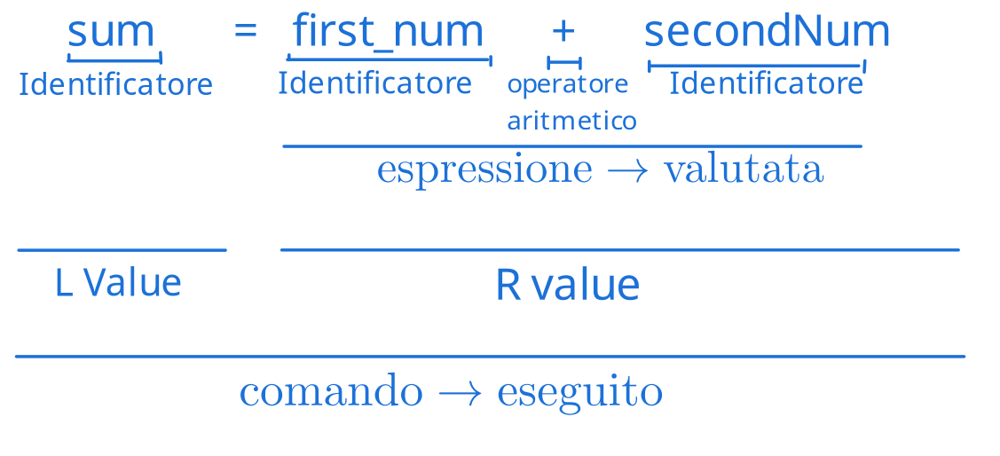

# Valutazione di un algoritmo
Un algoritmo può essere valutato sulla base di diversi fattori:  

- Correttezza
    - Dimostrazion eformale (matematica)
    - Ispezione informale
- Utilizzo delle risorse
    - Tempo di esecuzione
    - Utilizzo della memoria
    - Altre risorse (e.g. banda)
- Semplicità
    - Comprensibilità e mantenibilità

Nello specifico, il tempo di esecuzione può dipendere (e può essere influenzato) da tanti fattori  
Per questo motivo, quando valutiamo un algoritmo dobbiamo definire un modello  

## La macchina astratta
La macchina astratta è un **modello di calcolo** su cui è possibile fare i conti per astrarre dei dettagli implementativi dell'hardware.  
Un esempio può essere la macchina di Von-Neumann

### Modello RAM - Von-Neumann

Il modello RAM si basa sul cercare di creare un modello che possa essere condiviso tra tutti i tipi di computer moderni, evitando tuttavia ogni tipo di ottimizzazione trasparente e non diffusa.  
Il computer è suddiviso in due componenti astratti: memoria e processore.  

#### Memoria astratta
La memoria astratta è un insieme finito di celle contigue di memoria, ciascuna con un indirizzo (locazione) univoco ed un contenuto (valore della cella).  
Questa struttura permette operazioni di scrittura e lettura.  
Possiamo rappresentare quindi le operazioni matematicamente, prendendo ad esempio l'operazione di lettura:  
$\text{memoria } \sigma: \underbrace{Loc}_{\text{Locazione di memoria}} \to \underbrace{Val}_{\text{Valore della cella}}$  

Una delle operazioni più importante è l'assegnamento, che consiste nell'assegnamento.  
L'assegnamento si preoccupa di scrivere valori all'interno della locazione di memoria  
Valuta l'espressione a destra dell'operatore (che spesso è il simbolo di uguaglianza, `=`) nella locazione di memoria rappresentata dalla variabile (o identificatore) a sinistra



#### Processore astratto

Il processore astratto permette di fare calcoli e si occupa (virtualmente) di eseguire le operazioni che andiamo a rappresentare poi con le regole di inferenza.  
Si assume che le operazioni di letture es esecuzione id una computazione o scrittura impieghino una stessa unità di tempo costante.  

### Identificatori ed ambiente
Abbiamo parlato poco fa di identificatori, cerchiamo quindi di dare una spiegazione più formale:  

!!! definition "Definizione di Identificatore"
    Un'identificatore è una sequenza di caratteri (è una stringa) e permette di dare nomi alle locazioni (~il loader traduce i nomi in indirizzi fisici~) all'interno di un ambiente.  

!!! definition "Definizione di Ambiente"
    Un'ambiente è una funzione che associa nomi mnemonici alle locazioni  
    Come per la memoria, possiamo rappresentare l'ambiente con una funzione:  
    $\text{ambiente } \rho: \underbrace{Id}_{\text{Identificatore}} \to Loc$

### Variabili
Identificano le locazioni di memoria, il cui contenuto può essere variato durante l'esecuzione  
L'istruzione `a=b` si traduce in $\sigma(\underbrace{\rho(a)}_{\text{Indirizzo}}) = \underbrace{\sigma(\rho(b))}_{\text{Valore}}$ (siamo sicuri non sia $\rho(a) = \sigma(\rho(b))$?)

### Costanti
Le costanti sono identificatori che individuano variabili che non cambiano durante l'esecuzione. Nell'ambiente quindi, invece di avere un mapping ad una locazione di memoria, abbiamo direttamente il valore contenuto:  
$\rho: Id \to Loc \cup Var$ (che significa che dall'ambiente possiamo ottenere sia un valore (nel caso di una variabile) che una locazione di memoria (nel caso di una costante)).  

??? example "Esempio"
    Per valutare l'espressione `a = b + pi` dove `b` è una variabile e `pi` è una costante, l'espressione risultante sarà $\theta(\rho(a)) = \theta(\rho(b)) + \rho(pi)$


## Categorie sintattiche

### Dichiarazioni
Definiscono gli identificatori quando sono introdotti per la prima volta.  
Associano gli identificatori ad uan locazione di memoria libera, scrivendo il valore iniziale.  
Si **elaborano** per costruire l'ambiente.  

```js
var x = 4;
```
Che si traduce in:  
$\theta(\text{new } \rho(x)) = 4$  
Che viene dall'elaborazione della dichiarazione, che estende l'ambiente $\Delta$ in $\Delta^I$:  
$\Delta \vdash_d D: \Delta^I$ (che significa che dato un ambiente statico $\Delta$, elaborando la dichiarazione D, l'ambiente viene esteso, trasformando l'ambiente statico $\Delta$ in $\Delta^I$)

### Comandi
I comandi descrivono il cambiamento di stato e modificano la memoria o lo stato delle periferiche.  
I comandi si **ESEGUONO**  

```js
x = y + x;
```
Si traduce in  
$\sigma(\rho(x)) = \sigma(\rho(y)) + \sigma(\rho(x))$, elaborato dalla regola  
$C: \Delta \vdash_c C$  
Dato un ambiente $\Delta$, **eseguendo** il comando con i tipi definiti in $\Delta$ è tutto corretto

### Espressioni
Le espressioni rappresentano i valori su cui si opera **NON** modificano la memoria.  
Le espressioni si valutano  

```js
2*(x+y)
```
Che si traduce in:  
$E: \Delta \vdash_e: \tau$  
Dato un ambiente $\Delta$, l'espressione è ben formata ed è di tipo $\tau$


## Classi di complessità

Le classi di complessità ci permettono di categorizzare gli algoritmi in funzione della grandezza dell'input.  
Il tipo di comparazione che viene fatta è molto _spannometrica_, nel senso che spesso si tende a definire l'ordine di grandezza con cui l'algoritmo cresce, oppure il massimo (o minimo) tempo garantito che l'algoritmo impiegherà a fornire una risposta in funzione della grandezza dell'input. Il tutto approssimando il risultato a monomi (quindi ad esempio $log(n)$,$n$,$n^2$, $n!$, $n^n$, etc...)  
Questo tipo di valutazione ci consente di categorizzare gli algoritmi e poterli comparare in semplicità.  

I tipi di categorizzazione più usati sono spesso limite superiore e limite inferiore.  
Come si può intuire dal nome, questi limiti ci permettono di definire un tempo di esecuzione che sicuramente l'algoritmo (rispettivamente) non supererà o non migliorerà.  

Per questo motivo il limite superiore (conosciuto come Big O notation, o semplicemente O) è usato per individuare il costo delle soluzioni.  
Allo stesso modo, il limite inferiore (conosciuto come $\Omega$, o big omega) ci permette di individuare la complessità del problema che stiamo risolvendo.  

Quindi, per riassumere:

| Simbolo | Lettura     |       Tipo di limite          |          Significato           |
|:-------:|:-----------:|:-----------------------------:|:------------------------------:|
|   O     | O-grande    | Limite superiore asintotico   | Peggior situazione possibile   |
| $\Omega$|Omega Grande |Limite inferiore asintotico    | Migliore situazione possibile  |
| $\Theta$|Theta        | Limite asintotico stretto     | Complessità della soluzione    |

(asisntotico si può leggere come "_per valori che tendono a $\pin$_")

### Big-O

### Big Omega

### Theta

### Relazioni di ricorrenza

#### Master Theorem